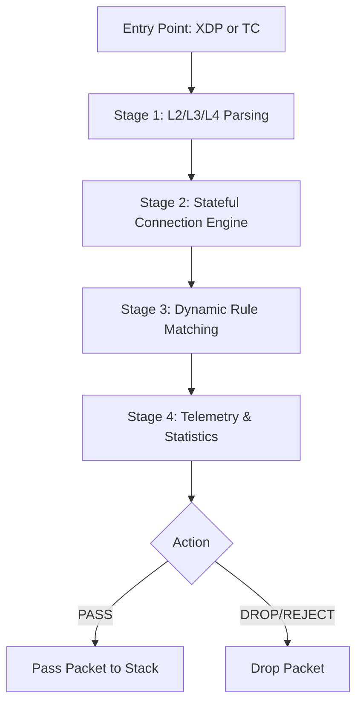
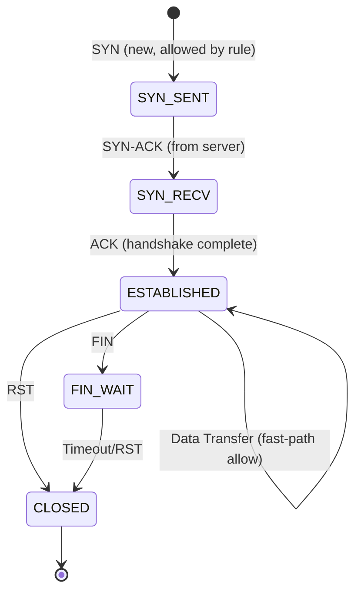

# eBPF/XDP Kernel Dataplane Architecture

## 1. Overview of eBPF and XDP Technology
The kernel dataplane of the High-Performance Stateful Firewall leverages extended Berkeley Packet Filter (eBPF) and eXpress Data Path (XDP) technologies. 
eBPF allows running sandboxed C-like programs in the Linux kernel without changing kernel source code or loading kernel modules. 
XDP provides a high-performance, programmable network data path in the Linux kernel. It hooks into the network stack at the lowest possible point—the network interface controller (NIC) driver—before the kernel allocates an `sk_buff` (socket buffer) data structure. This early intervention bypasses the heavy overhead of the traditional network stack, allowing for line-rate packet processing, which saves up to 90% CPU overhead compared to standard kernel processing.

## 2. XDP vs TC

While XDP is ideal for ingress traffic, it cannot natively handle egress traffic. Therefore, a hybrid approach is employed: XDP handles ingress traffic, while Traffic Control (TC) handles egress traffic.

| Feature | XDP (eXpress Data Path) | TC (Traffic Control) |
|---------|-------------------------|----------------------|
| **Hook Point** | Driver level, before `sk_buff` allocation | Network stack, after `sk_buff` allocation |
| **Direction** | Ingress only | Ingress and Egress |
| **Overhead** | Ultra-low (saves ~90% CPU) | Moderate (sk_buff overhead) |
| **Return Codes** | `XDP_PASS`, `XDP_DROP`, etc. | `TC_ACT_OK`, `TC_ACT_SHOT`, etc. |
| **Use Case in Project**| Fast-path ingress firewall filtering | Egress firewall filtering |

## 3. Architecture Overview

The kernel fast-path is implemented in eBPF C code and compiled to BPF bytecode. The entry points defined in `src/kernel/main.bpf.c` are:
1. `xdp_firewall_prog` (`SEC("xdp")`): Intercepts ingress packets at the network driver layer.
2. `tc_ingress_prog` (`SEC("tc")`): Acts as a fallback for TC ingress.
3. `tc_egress_prog` (`SEC("tc")`): Inspects outgoing frames on the TC egress hook.

All entry points invoke the shared `process_packet()` function, which defines a 4-stage processing pipeline.

### 4-Stage Pipeline Diagram



## 4. Pipeline Stages

### Stage 1: L2/L3/L4 Parsing
The protocol parser is responsible for structural validation and data extraction.
- **Ethernet (L2):** Validates the `ethhdr` structure (`proto_eth.bpf.h`). Non-IPv4 traffic (ARP, IPv6) is passed through without further inspection.
- **IPv4 (L3):** Validates the `iphdr` structure (`proto_ipv4.bpf.h`), ensuring valid lengths and checksums. Extracts `src_ip` and `dst_ip`.
- **L4 Parsing:** Parses TCP, UDP, and ICMP headers. Extracts the 5-tuple (`src_ip`, `dst_ip`, `src_port`, `dst_port`, `protocol`). For TCP traffic, it also isolates control flags (SYN, ACK, FIN, RST, PSH, URG).

### Stage 2: Stateful Connection Engine
A stateful tracking engine evaluates flow context using the `conntrack_map`.
- Uses the parsed 5-tuple as a `flow_key`.
- Implements a full TCP state machine.
- UDP and ICMP connections use pseudo-connection tracking based on inactivity timeouts.
- **Security Rule:** Unsolicited packets (e.g., packets with no prior SYN and no existing state entry) are unconditionally dropped.

### Stage 3: Dynamic Rule Matching
Evaluates firewall policies defined in `rules_map`.
- Rules are evaluated sequentially; the first matched rule dictates the action (PASS, DROP, REJECT).
- Matching criteria include: `src_ip/mask`, `dst_ip/mask`, port ranges, and protocol.
- Matches update the rule's `hit_count` and `byte_count`.
- **Default Action:** `DROP` if no rules match.

### Stage 4: Telemetry & Statistics
Records operational metrics and emits detailed telemetry.
- Increments per-CPU counters in `stats_map` for line-rate accounting.
- Streams a `packet_event` structure to userspace via `events_ringbuf`, containing the 5-tuple, action taken, connection state, matched rule ID, packet length, and TCP flags.

## 5. BPF Maps

BPF maps facilitate state sharing between eBPF programs and userspace applications.

| Map Name | Type | Key | Value | Max Entries | Purpose |
|----------|------|-----|-------|-------------|----------|
| `stats_map` | `PERCPU_ARRAY` | `u32` | `u64` | 16 counters | Line-rate per-CPU statistics (e.g., packets passed/dropped) |
| `events_ringbuf`| `RINGBUF` | - | `packet_event` | 64KB | Real-time telemetry stream to userspace |
| `rules_map` | `ARRAY` | `u32` | `fw_rule` | 128 | Dynamic firewall policy rules |
| `conntrack_map` | `HASH` | `flow_key` | `flow_entry` | 65536 | Stateful connection tracking (flow state and timeouts) |

## 6. Packet Context Structure (`pkt_ctx`)

To maintain state and pass information through the pipeline, a context structure is utilized:

```c
struct pkt_ctx {
    void *data;          // Pointer to packet start
    void *data_end;      // Pointer to packet end
    __u32 pkt_len;       // Total packet length
    __u16 eth_proto;     // Ethernet protocol (e.g., ETH_P_IP)
    __u8  direction;     // DIR_INGRESS or DIR_EGRESS
    __u8  proto;         // L4 Protocol (IPPROTO_TCP, IPPROTO_UDP, etc.)
    struct ethhdr *eth;  // Parsed Ethernet header
    struct iphdr  *iph;  // Parsed IPv4 header
    void *l4_hdr;        // Parsed L4 header
    __u32 src_ip, dst_ip;// Source and Destination IP addresses
    __u16 src_port, dst_port; // Source and Destination Ports
    __u8  tcp_flags;     // Extracted TCP flags
    __u8  action;        // Final computed action
    __u8  conn_state;    // Current connection state
    __u32 rule_id;       // ID of the matched rule
};
```

## 7. Connection State Management

### TCP State Machine

The connection tracking engine correctly tracks the TCP three-way handshake and teardown:



### Connection Timeouts

State entries are subject to automated garbage collection based on protocol-specific timeouts:

| Protocol State | Timeout |
|----------------|---------|
| TCP SYN | 30 seconds |
| TCP ESTABLISHED | 5 minutes |
| TCP CLOSE | 10 seconds |
| UDP (Pseudo-state)| 30 seconds |
| ICMP (Pseudo-state)| 10 seconds |

## 8. Code Flow Walkthroughs

### 8.1 Scenario A: Processing a TCP SYN Packet (End-to-End)
1. **Entry:** Packet arrives at the NIC. The `xdp_firewall_prog` eBPF hook is triggered.
2. **Stage 1 (Parsing):** The packet is parsed. L2=Ethernet, L3=IPv4, L4=TCP. `tcp_flags` reveals a SYN flag. The 5-tuple is extracted.
3. **Stage 2 (Conntrack):** The engine hashes the 5-tuple and queries `conntrack_map`. No entry exists. Since it is a SYN packet, this is a valid connection initiation attempt.
4. **Stage 3 (Rules):** The packet is evaluated against `rules_map`. Assuming rule #4 matches (e.g., Allow port 80/443), the action is evaluated to `PASS`.
5. **Stage 2 (Conntrack Update):** Since the rule allowed the packet, a new flow entry is created in `conntrack_map` with state `CONN_STATE_SYN_SENT` and a timeout of 30 seconds.
6. **Stage 4 (Telemetry):** `stats_map` PASS counter is incremented. An event is pushed to `events_ringbuf`.
7. **Exit:** The program returns `XDP_PASS` and the packet continues up the Linux network stack.

### 8.2 Scenario B: Unsolicited ACK Packet
1. **Entry:** Packet arrives via the XDP hook.
2. **Stage 1 (Parsing):** L4 header parsed as TCP. `tcp_flags` reveals an ACK flag (with no SYN). 
3. **Stage 2 (Conntrack):** The 5-tuple is hashed and `conntrack_map` is queried. No entry exists.
4. **Validation Failure:** The engine detects a TCP packet with an ACK flag but no established state and no prior SYN. This is deemed an unsolicited packet (potential scanning or spoofing).
5. **Action:** The packet is immediately flagged for `DROP`. Rule evaluation (Stage 3) is bypassed.
6. **Stage 4 (Telemetry):** `stats_map` DROP counter is incremented. A DROP event is emitted to `events_ringbuf`.
7. **Exit:** The program returns `XDP_DROP`, and the NIC silently discards the packet, saving CPU cycles.
