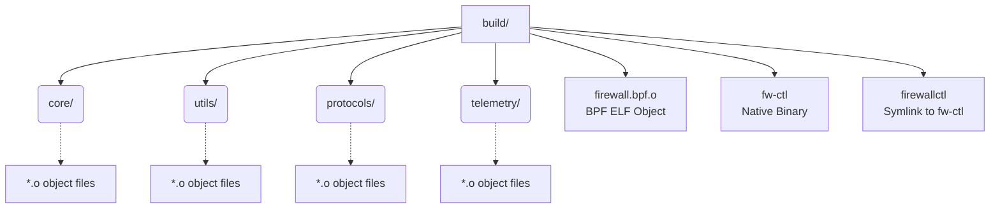
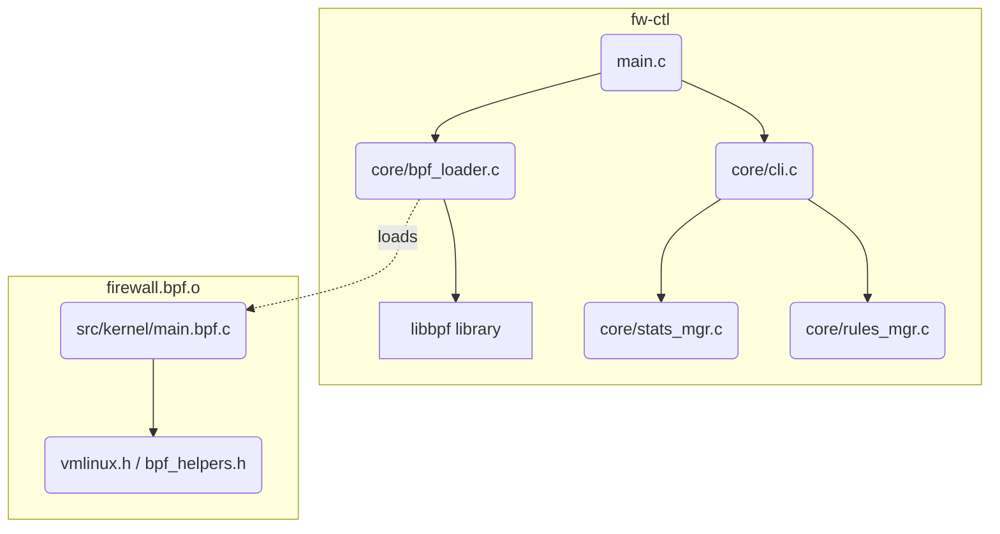

# Build Process & Compilation Guide

This document provides a comprehensive, technical overview of the build system and compilation process for the High-Performance Stateful eBPF/XDP Firewall. It is designed to aid developers and researchers in understanding the toolchain, dependencies, and two-phase compilation strategy employed by the project.

---

## 1. Prerequisites and System Requirements

The build process requires a modern Linux environment equipped with eBPF compilation toolchains and library dependencies.

### 1.1 System Requirements
*   **Operating System**: Linux
*   **Kernel Version**: >= 5.15
*   **Kernel Features**: 
    *   BTF (BPF Type Format) support enabled (verifiable via `/sys/kernel/btf/vmlinux`).
    *   IP Forwarding enabled (`net.ipv4.ip_forward=1`).
*   **Filesystems**: BPF filesystem mounted (typically at `/sys/fs/bpf`).

### 1.2 Package Dependencies

A `scripts/setup.sh` script is provided to automate environment preparation, but dependencies can be installed manually using the system package manager.

**Debian/Ubuntu (`apt`)**
```bash
sudo apt-get update
sudo apt-get install build-essential clang llvm libbpf-dev libelf-dev \
    zlib1g-dev gcc-multilib iproute2 linux-headers-$(uname -r)
```

**Fedora/RHEL (`dnf`)**
```bash
sudo dnf install gcc clang llvm make libbpf-devel elfutils-libelf-devel \
    zlib-devel kernel-headers
```

### 1.3 Post-Installation Setup
Before deploying the firewall, specific system configurations must be applied:
```bash
# Enable IPv4 forwarding
sudo sysctl -w net.ipv4.ip_forward=1

# Initialize Incus daemon (if utilizing containers)
sudo incus admin init

# Create persistent BPF filesystem directory for map pinning
sudo mkdir -p /sys/fs/bpf/firewall
```

---

## 2. The Two-Phase Compilation Strategy

eBPF projects require a bifurcated build process because the kernel-space packet processing code and the user-space control plane operate on different architectures and execution contexts.

### Phase 1: BPF Target Compilation (Kernel Space)
*   **Compiler**: Clang / LLVM
*   **Target Architecture**: BPF ISA (`-target bpf`)
*   **Process**: C source code (`src/kernel/main.bpf.c`) is compiled into an ELF (Executable and Linkable Format) object containing BPF bytecode. 
*   **Runtime Execution**: This bytecode is not native machine code. It is loaded into the kernel via the `bpf()` syscall, where the in-kernel BPF Verifier ensures its safety before the JIT (Just-In-Time) compiler translates it into native machine instructions.

### Phase 2: Native Target Compilation (User Space)
*   **Compiler**: GCC
*   **Target Architecture**: Native (e.g., x86_64, aarch64)
*   **Process**: Regular C code comprising the control plane is compiled and linked against `libbpf`.
*   **Runtime Execution**: This generates a standard native binary (`fw-ctl`). At runtime, this binary utilizes `libbpf` to parse the ELF object generated in Phase 1, create and manage BPF maps, and load the BPF programs into the kernel.

---

## 3. Step-by-Step Build Instructions

Building the project is streamlined via a GNU Makefile.

1.  **Clone the repository and navigate to the project root:**
    ```bash
    cd /home/Nishant/code/FirewallProgram
    ```
2.  **Execute the build:**
    ```bash
    make
    ```
3.  **Verify the build artifacts:**
    Ensure `build/firewall.bpf.o` and `build/fw-ctl` have been generated successfully.

### 3.1 Makefile Targets

| Target | Description |
| :--- | :--- |
| `make` or `make all` | Default target. Compiles both the BPF object and the userspace binary. |
| `make bpf` | Compiles *only* the BPF bytecode ELF object (`firewall.bpf.o`). |
| `make userspace` | Compiles *only* the native userspace control binary (`fw-ctl`). |
| `make clean` | Removes the `build/` directory and all compiled artifacts. |

---

## 4. Compilation Flags In-Depth

### 4.1 BPF Compilation Flags (Clang)
The Makefile invokes Clang with the following core flags for the BPF target:
`clang -O2 -g -Wall -target bpf -D__TARGET_ARCH_$(ARCH) $(ARCH_INC) -I/usr/include -Iinclude -Isrc/kernel`

*   `-O2`: Optimization level 2 is **mandatory** for BPF. The kernel verifier relies on compiler optimizations to analyze program state safely; unoptimized code often fails verification.
*   `-g`: Emits BTF (BPF Type Format) debugging information into the ELF object, crucial for CO-RE (Compile Once - Run Everywhere).
*   `-Wall`: Enables all standard warnings.
*   `-target bpf`: Instructs LLVM to emit BPF bytecode rather than native assembly.
*   `-D__TARGET_ARCH_$(ARCH)`: Defines a preprocessor macro indicating the host architecture, used by kernel headers to resolve architecture-specific structs.

### 4.2 Userspace Compilation and Linking Flags (GCC)
The Makefile invokes GCC for the userspace application:
`gcc -O2 -g -Wall -Iinclude -Isrc/userspace -lbpf -lelf -lz`

*   `-Iinclude -Isrc/userspace`: Specifies include directories for project-specific headers.
*   `-lbpf`: Links the libbpf library, required for loading and managing BPF programs/maps.
*   `-lelf`: Links libelf, utilized by libbpf to parse the BPF ELF object files.
*   `-lz`: Links zlib, required for decompressing kernel modules/BTF data if compressed.

---

## 5. Build Directory and Source Organization

### 5.1 Build Directory Structure
Upon successful compilation, the Makefile generates the following structure in the `build/` directory:



### 5.2 Source File Organization

| File/Path | Component | Purpose |
| :--- | :--- | :--- |
| `src/kernel/main.bpf.c` | eBPF Kernel | Main entry point for XDP/TC eBPF programs. Contains packet parsing and map lookups. |
| `src/userspace/main.c` | Userspace | Entry point for the `fw-ctl` application. |
| `src/userspace/core/cli.c` | Userspace | Command-Line Interface argument parsing and dispatching. |
| `src/userspace/core/config.c` | Userspace | Loads and parses firewall configurations (e.g., from YAML/JSON/CLI). |
| `src/userspace/core/bpf_loader.c` | Userspace | Wraps `libbpf` calls to load `firewall.bpf.o` into the kernel and attach it to interfaces. |
| `src/userspace/core/firewall_ctx.c` | Userspace | Manages the global application state and context. |
| `src/userspace/core/rules_mgr.c` | Userspace | Interfaces with BPF maps to insert, delete, and list firewall rules. |
| `src/userspace/core/conntrack_mgr.c`| Userspace | Manages stateful connection tracking maps. |
| `src/userspace/core/stats_mgr.c` | Userspace | Retrieves performance and packet statistics from BPF maps. |
| `src/userspace/utils/ip_utils.c` | Userspace | Helper functions for IP address string-to-binary conversions and CIDR logic. |
| `src/userspace/utils/format_utils.c`| Userspace | Helper functions for formatting console output and tables. |
| `src/userspace/protocols/protocol_registry.c`| Userspace| Registry for protocol-specific handlers. |
| `src/userspace/protocols/proto_tcp.c`| Userspace | TCP-specific logic and flag handling. |
| `src/userspace/protocols/proto_udp.c`| Userspace | UDP-specific logic. |
| `src/userspace/protocols/proto_icmp.c`| Userspace| ICMP-specific logic. |
| `src/userspace/telemetry/event_bus.c`| Userspace | Handles asynchronous events from the kernel via BPF Ringbuffers/Perf buffers. |

### 5.3 High-Level Dependency Graph



---

## 6. Troubleshooting and Maintenance

### 6.1 Common Build Errors

**Error: `fatal error: 'bpf/bpf_helpers.h' file not found`**
*   **Cause**: `libbpf-dev` is missing, or the include paths in the Makefile are incorrect.
*   **Fix**: Ensure `libbpf-dev` is installed. Verify the `-I` paths in `BPF_CFLAGS`.

**Error: `fatal error: 'vmlinux.h' file not found`**
*   **Cause**: The BTF-generated kernel headers are missing.
*   **Fix**: You may need to generate `vmlinux.h` using `bpftool`:
    `bpftool btf dump file /sys/kernel/btf/vmlinux format c > include/vmlinux.h`

**Error: `libbpf: failed to find valid kernel BTF`** (At Runtime)
*   **Cause**: Your kernel does not have BTF enabled (`CONFIG_DEBUG_INFO_BTF=y`).
*   **Fix**: Upgrade to a kernel that provides `/sys/kernel/btf/vmlinux`.

**Error: BPF verifier rejects program (e.g., `R1 invalid mem access...`)**
*   **Cause**: The BPF bytecode failed safety checks. Often caused by forgetting bounds checking on packet data.
*   **Fix**: This is a code issue, not a build issue. Ensure all packet accesses in `main.bpf.c` are bounded by `data_end`. Also, ensure Clang `-O2` is used.

### 6.2 Clean Rebuild Instructions
If the build state becomes corrupted or after fetching significant updates from version control, a clean rebuild is recommended:

```bash
# 1. Purge all existing build artifacts
make clean

# 2. Verify the build directory is removed
ls build/ # Should return 'No such file or directory'

# 3. Rebuild both targets from scratch
make
```
