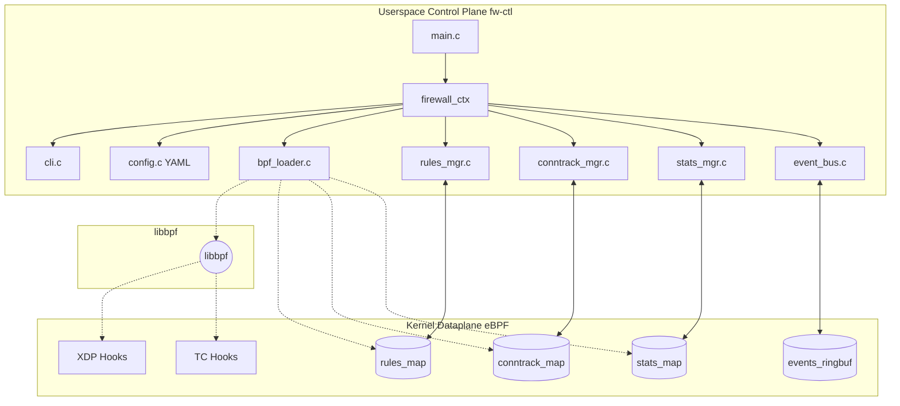

# Userspace Control Plane & CLI Reference

## 1. Architecture Overview

The userspace binary (`fw-ctl`, aliased as `firewallctl`) serves as both a firewall daemon and a command-line interface (CLI) management tool. It bridges the gap between administrator commands and the high-performance eBPF/XDP kernel dataplane. 

The architecture is built around a central context, modular subsystems, and libbpf-driven lifecycle management. The core components are organized as follows:

*   **Main Entry (`main.c`)**: Defines signal handlers for graceful shutdown (SIGINT/SIGTERM) and configuration reload (SIGHUP), invoking the central state object.
*   **Context Management (`firewall_ctx.c/h`)**: The master orchestrator containing the `firewall_ctx` struct. It handles initialization, CLI parsing, BPF lifecycle, rule and connection state management, and telemetry.
*   **CLI Parser (`cli.c/h`)**: Supports launching the program either in daemon mode to actively process packets or in management mode to query/modify active state.
*   **Configuration (`config.c/h`)**: Parses YAML-based settings (`firewall.yaml`) for operational parameters.
*   **BPF Loader (`bpf_loader.c/h`)**: A wrapper around `libbpf` that manages the lifecycle of BPF programs: opening ELF objects, loading them, attaching hooks (XDP/TC), and pinning maps for persistence.
*   **Subsystem Managers**:
    *   **Rule Management (`rules_mgr.c/h`)**: Adds, deletes, lists, and loads rules from YAML directly into the kernel's array map.
    *   **Conntrack Management (`conntrack_mgr.c/h`)**: Introspects the stateful connection tracking hash map.
    *   **Stats Management (`stats_mgr.c/h`)**: Aggregates per-CPU counters into readable formats.
*   **Telemetry & Utilities**:
    *   **Event Bus (`event_bus.c/h`)**: Polls the BPF ring buffer for telemetry.
    *   **Protocol Registry (`protocol_registry.c/h`)**: Display adapters for TCP, UDP, ICMP.
    *   **Utilities (`ip_utils.c/h`, `format_utils.c/h`)**: Helpers for IP and data formatting.

## 2. Component Diagram



## 3. Daemon Mode vs. Management Mode

The userspace binary (`fw-ctl`) is designed with a dual-role architecture:

1.  **Daemon Mode**: This is the background process responsible for parsing the initial configuration, loading the BPF programs via `libbpf`, attaching the hooks (XDP/TC), creating the necessary `sysfs` map pins, and polling the ring buffer for real-time events. It holds the reference to the running BPF object.
2.  **Management Mode**: When invoked as a management client (e.g., `fw-ctl rule list`), the tool does *not* attempt to load new BPF programs. Instead, it locates the active pinned maps in `/sys/fs/bpf/firewall/`, connects to them, performs the requested operation (read/write), and exits immediately. This separation ensures that rule updates or stats queries do not interrupt the core daemon.

## 4. CLI Reference

The CLI provides both daemon startup options and state management subcommands.

### Daemon Execution
```bash
fw-ctl -i <iface> [-m hybrid|tc|xdp] [-d in|out|both] [-c config.yaml] [-r rules.yaml]
```

### Rule Management
*   `fw-ctl rule list`: Displays active rules in a formatted table.
*   `fw-ctl rule add --proto <tcp|udp|icmp|any> --src <ip/cidr> --dst <ip/cidr> --sport <port> --dport <port|range> --action <allow|drop> --desc <text>`: Dynamically inserts a rule into the first available map slot.
*   `fw-ctl rule del <rule_id>`: Removes a rule by its map index.
*   `fw-ctl rule flush`: Zeroes out all rule slots, effectively clearing the policy.
*   `fw-ctl rule load <rules.yaml>`: Parses a YAML rules file and loads the configuration sequentially into the rules map.

### Connection Tracking
*   `fw-ctl conntrack list`: Iterates over the connection tracking hash map and displays active flows, their states, and packet/byte counters.
*   `fw-ctl conntrack flush`: Deletes all active entries from the connection tracking map.

### Statistics Management
*   `fw-ctl stats show [--json]`: Aggregates per-CPU counters and outputs general statistics in plain text or JSON format.
*   `fw-ctl stats reset`: Zeroes out all active counters across all CPUs.

## 5. BPF Loader Lifecycle

The BPF lifecycle is strictly managed by `bpf_loader.c` through the following phases:

1.  **Load**: Uses `libbpf` to open the compiled BPF ELF object (`firewall.bpf.o`), process BTF information, and load the bytecode into the kernel.
2.  **Attach**: Depending on the specified mode, it attaches the loaded programs. It attempts to attach XDP programs using native driver mode, falling back to SKB (generic) mode if unsupported. For TC, it creates a `clsact` qdisc and attaches ingress/egress programs.
3.  **Pin**: To enable independent management, the loader pins BPF maps to the standard virtual file system mount (`/sys/fs/bpf/firewall/`).
4.  **Run**: The daemon transitions to a running state, periodically polling the telemetry ring buffer and awaiting management signals.
5.  **Cleanup**: Upon termination (e.g., SIGTERM), the loader detaches the XDP hooks, destroys the TC `clsact` qdisc, unpins the maps, and safely closes the BPF object.

## 6. Attachment Mode Comparison

The system supports multiple attachment strategies to balance performance and compatibility.

| Mode | Description | Ingress | Egress | Performance | Use Case |
| :--- | :--- | :--- | :--- | :--- | :--- |
| **Hybrid** (Default) | Uses XDP for ingress and TC for egress. | XDP | TC | High | Standard server protection needing bidirectional stateful filtering. |
| **XDP Only** | Pure XDP ingress attachment. Auto-switches to TC if egress is requested. | XDP | None | Highest | Edge routers or anti-DDoS where only inbound filtering matters. |
| **TC Only** | Uses TC for both ingress and egress filtering. | TC | TC | Moderate | Environments where XDP drivers are unavailable or complex QoS routing is required. |

## 7. Map Pinning Mechanism

Maps are pinned to the BPF virtual filesystem, specifically under `/sys/fs/bpf/firewall/`.

**Pinned Maps:**
*   `/sys/fs/bpf/firewall/rules_map`
*   `/sys/fs/bpf/firewall/conntrack_map`
*   `/sys/fs/bpf/firewall/stats_map`
*   `/sys/fs/bpf/firewall/events_ringbuf`

**Rationale:** Map pinning allows BPF map file descriptors to outlive the process that created them. If `fw-ctl` management commands were to simply load the BPF object every time, they would get fresh (empty) maps. Pinning enables independent ephemeral processes (like `fw-ctl stats show`) to retrieve file descriptors to the *active* kernel maps populated by the background daemon.

## 8. Configuration File Reference

The main operational settings are stored in `firewall.yaml` (typically parsed by `config.c`).

```yaml
interface: eth0                  # Target network interface
global:
  direction: both                # Filtering direction: in, out, or both
  mode: hybrid                   # Attachment mode: hybrid, tc, xdp
  log_level: info                # Logging verbosity
  stats_interval_sec: 1          # Telemetry export interval
  ringbuf_poll_timeout_ms: 100   # Event bus poll timeout
  default_policy: pass           # Default action if no rule matches (pass/drop)
```

## 9. Rules YAML Format Reference

Administrator policies are declared in an intuitive YAML array format.

```yaml
- name: "Allow HTTP Web Traffic" # Human-readable label
  proto: tcp                     # Protocol: tcp, udp, icmp, any
  dst: 10.10.2.10                # Destination IP/CIDR
  dport: 80                      # Destination port or range
  action: allow                  # Action: allow, drop
  desc: "Nginx HTTP"             # Additional descriptive metadata
```

## 10. Dynamic Rule Updates and BPF Maps

A critical capability of this architecture is the ability to mutate the firewall policy without recompiling or reloading the BPF kernel programs. 

This is achieved using BPF Maps—specifically, a `BPF_MAP_TYPE_ARRAY` or `BPF_MAP_TYPE_HASH` for rules. The management CLI writes binary structs directly to the map via the `bpf_map_update_elem()` syscall. The next packet processed by the kernel immediately reflects the updated rule logic.

## 11. Statistics Aggregation (Per-CPU Counters)

To prevent cache-line bouncing and lock contention, statistics in the dataplane utilize `BPF_MAP_TYPE_PERCPU_ARRAY`.
When `fw-ctl stats show` is called, `stats_mgr.c` executes a `bpf_map_lookup_elem()`. The kernel returns an array of values—one for each logical CPU core on the system. The userspace binary then iterates over this array, summing the counters to present the aggregated system-wide totals to the administrator.

## 12. Signal Handling Behavior

*   **SIGINT (Ctrl+C) / SIGTERM**: Triggers the graceful shutdown sequence. The `firewall_ctx` loop exits, passing control to the cleanup routines which detach BPF hooks, remove map pins, and free memory. This leaves the system clean.
*   **SIGHUP**: Triggers a configuration reload. `config.c` re-reads `firewall.yaml`, and applicable settings are updated in the running daemon without incurring dataplane downtime or resetting connection states.

## 13. Example Usage

**1. Launch the firewall daemon in Hybrid mode**
```bash
fw-ctl -i eth0 -m hybrid -d both -c /etc/fw/firewall.yaml
```
*Starts the daemon on `eth0`, using XDP for ingress and TC for egress.*

**2. Dynamically add an SSH rule**
```bash
fw-ctl rule add --proto tcp --dst 192.168.1.0/24 --dport 22 --action allow --desc "Admin SSH"
```
*Immediately updates the kernel's `rules_map` to permit SSH traffic to the specified subnet without restarting the daemon.*

**3. Inspect connection tracking state**
```bash
fw-ctl conntrack list
```
*Reads the `conntrack_map` and displays active TCP/UDP sessions.*

**4. Dump telemetry metrics in JSON**
```bash
fw-ctl stats show --json
```
*Aggregates per-CPU counters and outputs JSON, ideal for integration with external monitoring tools.*
