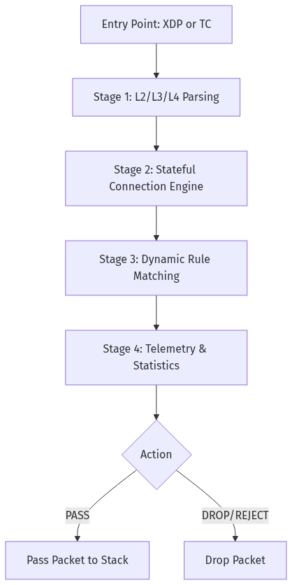
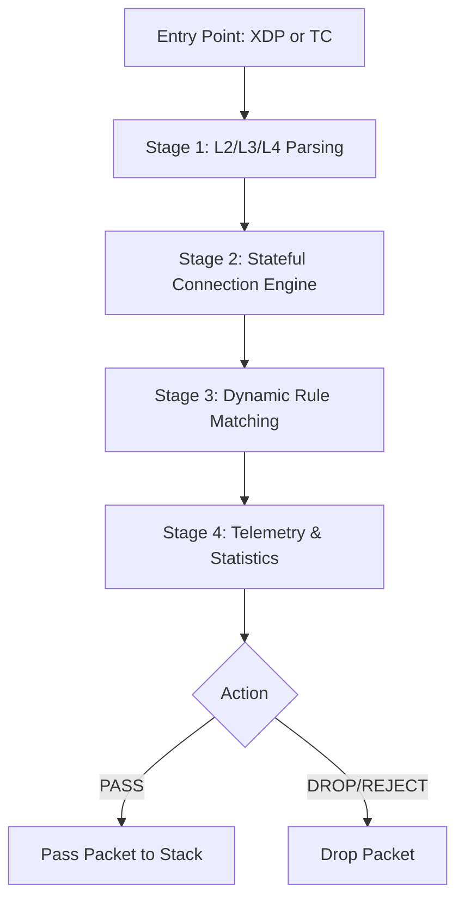
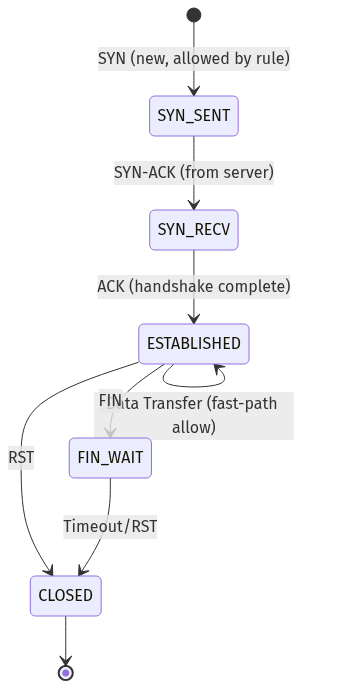
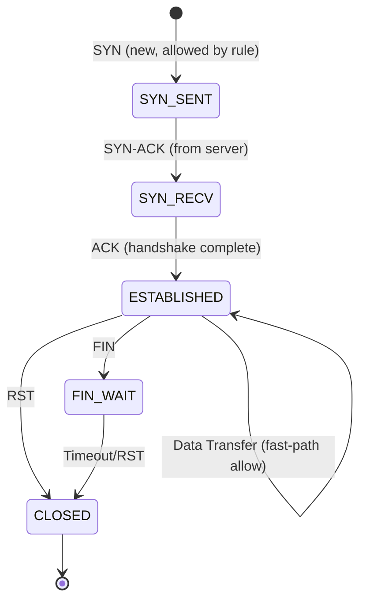
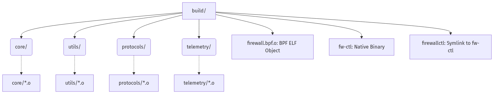
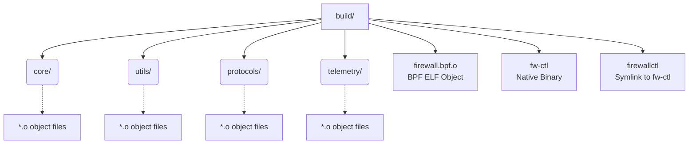
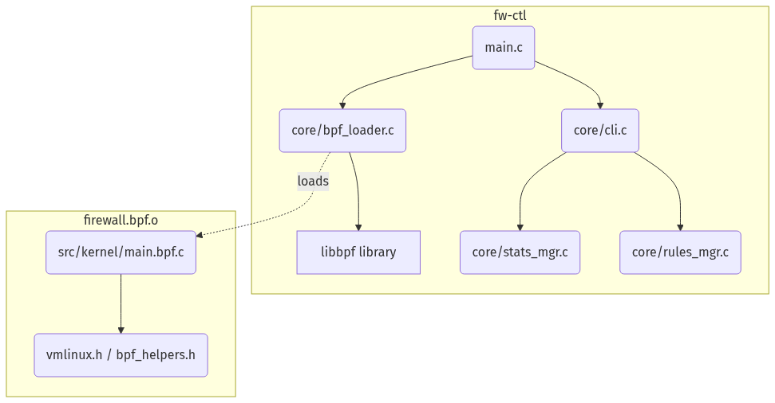
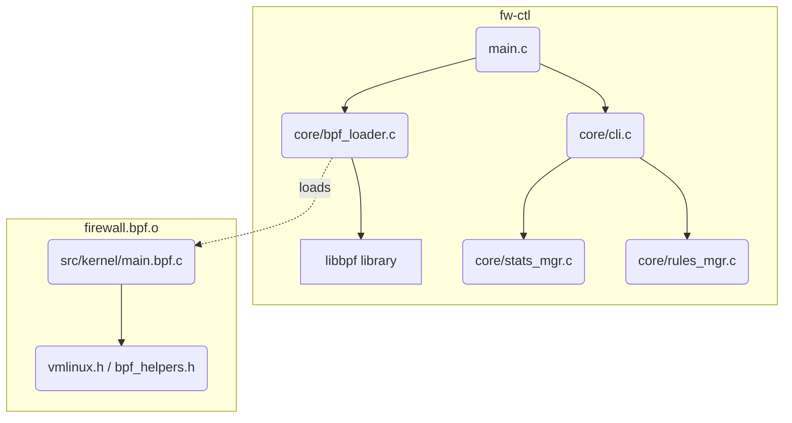
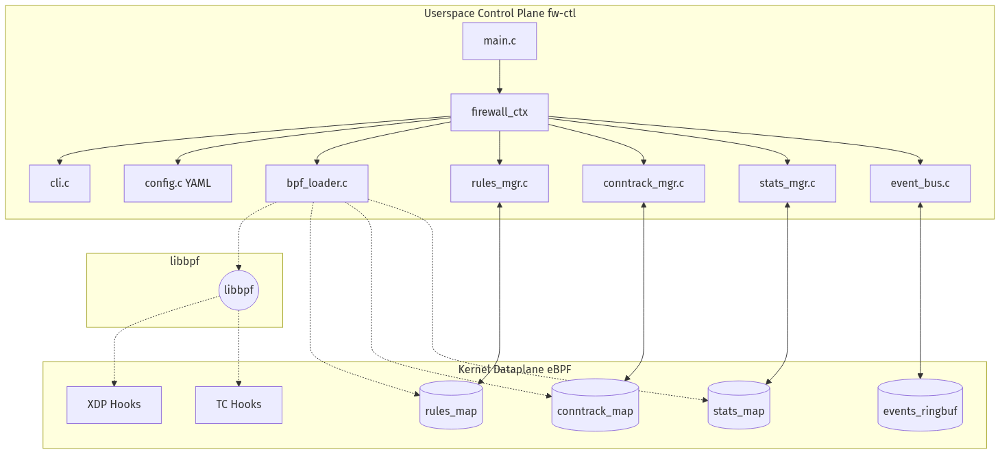
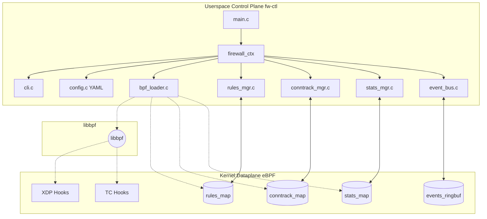

<!-- SECTION START: Project Overview -->

# High-Performance Stateful eBPF/XDP Firewall

A high-throughput, kernel-native stateful firewall built on **eBPF** and **XDP** on Linux, paired with a flexible userspace control plane (`firewallctl`).

---

## 📋 Architectural Overview (The 16 Steps)

1. **Single Linux Host**: Runs host routing, Incus container lab, and the eBPF kernel dataplane.
2. **Incus Containers**: Lightweight containers (`client`, `attacker`, `webserver`, `admin`) acting as independent network hosts.
3. **Three Network Segments**: Untrusted (`10.10.1.0/24`), Protected (`10.10.2.0/24`), and Management (`10.10.99.0/24`).
4. **Host Routing**: Joined via host bridges (`incus-untrust`, `incus-protect`) and routed by the host kernel.
5. **XDP Ingress Hook**: Early packet filtering before SKB allocation in the Linux network driver.
6. **eBPF Logic Pipeline**: 4-stage processing: Parser → State Engine → Rule Matcher → Telemetry.
7. **5-Tuple Packet Parsing**: Extracts source/dest IP, source/dest port, protocol, and TCP flags.
8. **Dynamic eBPF Rule Table**: Policy rules stored in `rules_map` array for zero-recompile runtime updates.
9. **Stateful Connection Tracking**: Full TCP handshake and flow lifecycle management in `conntrack_map`.
10. **Userspace Control Tool (`firewallctl`)**: Dynamic policy management, conntrack inspection, and telemetry.
11. **Granular Statistics**: Per-CPU line-rate counters for packets, drops, and flow states in `stats_map`.
12. **Baseline Comparison**: Standardized comparison against kernel `nftables`.
13. **Traffic Generation**: `iperf3` throughput, `ping` latency, and `hping3` attack simulations.
14. **Test Suite**: Automated verification of allowed traffic, blocked ports, state tracking, and unsolicited packet drops.
15. **Packet Path Validation**: Traced transit across veth pairs, bridges, XDP, and routing FIB.
16. **Expandable Platform**: Modular foundation for rate limiting, SYN cookies, and machine learning telemetry.

---

## 🚀 Quick Start

### 1. Install Dependencies & Verify Environment (Step 1)
```bash
bash scripts/setup.sh
```

### 2. Initialize Container Lab & 3 Networks (Steps 2 & 3)
```bash
bash scripts/setup_env.sh
```

### 3. Build eBPF Dataplane & Userspace Utility
```bash
make
```

### 4. Start the Stateful Firewall
```bash
# Attach to the untrusted bridge interface
sudo ./build/fw-ctl -i incus-untrust -m hybrid -d both
```

---

## 🛠️ CLI Management with `firewallctl` (Step 10)

`firewallctl` communicates directly with kernel eBPF maps:

```bash
# View active rules
sudo ./build/firewallctl rule list

# Add a rule to allow HTTP web traffic
sudo ./build/firewallctl rule add --proto tcp --dport 80 --action allow --desc "HTTP Web"

# Add a rule to allow iperf3 benchmarks
sudo ./build/firewallctl rule add --proto tcp --dport 5201 --action allow --desc "iperf3"

# Add a rule to allow ICMP ping
sudo ./build/firewallctl rule add --proto icmp --action allow --desc "Ping Echo"

# Load rules from YAML configuration
sudo ./build/firewallctl rule load config/rules.yaml

# Delete a rule by ID
sudo ./build/firewallctl rule del 1

# Flush all active rules
sudo ./build/firewallctl rule flush

# View active stateful connections
sudo ./build/firewallctl conntrack list

# View firewall packet and drop statistics (Step 11)
sudo ./build/firewallctl stats show

# Export statistics as JSON
sudo ./build/firewallctl stats show --json
```

---

## 🧪 Testing & Validation (Steps 12, 14, 15)

### Run the Step 14 Automated Test Suite
```bash
bash test/run_all_tests.sh 10.10.2.10
```
Verifies:
- ✅ Allowed HTTP & ICMP traffic passes.
- ✅ Unauthorized ports (e.g. 8080) are dropped.
- ✅ Full TCP 3-way handshake is recorded statefully in `conntrack_map`.
- ✅ Unsolicited ACK/SYN-ACK packets with no state are dropped.

### Run the Step 12 Comparative Benchmark (nftables vs XDP)
```bash
bash test/benchmark_baseline_nftables.sh 10.10.2.10
```

### Trace Packet Path (Step 15)
```bash
bash scripts/trace_packet_path.sh
```

---

## 📂 Project Directory Structure

```text
├── Makefile                   # Build automation for eBPF and userspace
├── Design.md                  # Comprehensive 16-step architectural design
├── README.md                  # User guide & operations manual
├── config/
│   ├── firewall.yaml          # Global runtime parameters & interfaces
│   └── rules.yaml             # Declarative firewall policy rules
├── docs/
│   ├── PACKET_PATH_VALIDATION.md   # Step 15 packet path flow documentation
│   └── ARCHITECTURE_AND_EXTENSIONS.md # Step 16 future platform extensions
├── include/
│   ├── core/
│   │   ├── constants.h        # Capacity limits, timeouts, and actions
│   │   ├── types.h            # Telemetry events and shared types
│   │   ├── stats.h            # Step 11 statistics counter definitions
│   │   ├── rules.h            # Step 8 rule structure definitions
│   │   └── conntrack.h        # Step 9 flow key and state structures
│   └── protocols/
│       └── icmp_types.h       # Protocol header definitions
├── src/
│   ├── kernel/
│   │   ├── main.bpf.c         # eBPF XDP/TC entrypoint and pipeline
│   │   ├── core/
│   │   │   ├── context.bpf.h  # Unified packet context
│   │   │   ├── maps.bpf.h     # BPF maps (rules, conntrack, stats, events)
│   │   │   ├── helpers.bpf.h  # Helper functions and ringbuf emission
│   │   │   ├── rules.bpf.h    # Step 8 dynamic rule matching engine
│   │   │   └── conntrack.bpf.h# Step 9 stateful TCP/UDP/ICMP engine
│   │   └── protocols/         # L2/L3/L4 protocol parsers
│   └── userspace/
│       ├── main.c             # Firewall main entrypoint
│       └── core/
│           ├── bpf_loader.c   # BPF object loader & map pinning
│           ├── cli.c          # firewallctl CLI argument parser
│           ├── config.c       # YAML configuration parser
│           ├── rules_mgr.c    # Step 8 rule manager
│           ├── conntrack_mgr.c# Step 9 connection tracking manager
│           └── stats_mgr.c    # Step 11 telemetry manager
├── scripts/
│   ├── setup.sh               # Step 1 dependency installer (apt & dnf)
│   ├── setup_env.sh           # Steps 2 & 3 Incus testbed provisioner
│   ├── teardown_env.sh        # Testbed cleanup script
│   └── trace_packet_path.sh   # Step 15 packet tracing utility
└── test/
    ├── run_all_tests.sh       # Step 14 automated test cases
    ├── benchmark_baseline_nftables.sh # Step 12 nftables vs XDP benchmark
    ├── traffic_attacker.sh    # Hostile traffic generator (SYN floods, scans)
    ├── traffic_client.sh      # Legitimate client traffic simulator
    └── traffic_server.sh      # Target server daemon starter
```

---

## 📚 Project Documentation

Comprehensive technical documentation is organized in the **docs/** directory:

- ****Master Documentation Index****: Complete document roadmap, reading paths, directory layout, and architectural overview.
- **System Modules**: Dedicated documentation covering Container Lab Setup, eBPF Dataplane, Build Process, Userspace Control Plane, Testing & Benchmarking, Packet Path Validation, and Platform Extensions.
- **Unified PDF Manual**: A complete single-file PDF manual consolidating all documentation is available at `Firewall_Documentation.pdf`.

---

## 🧹 Teardown

To clean up all test containers and virtual network bridges:
```bash
bash scripts/teardown_env.sh
```


<!-- SECTION START: Architectural Blueprint -->

# Comprehensive Stateful eBPF/XDP Firewall Architecture & Implementation Guide

## 1. Overview & Core Philosophy

This project implements a high-performance, kernel-native stateful firewall using **eBPF (Extended Berkeley Packet Filter)** and **XDP (eXpress Data Path)** on Linux. The system provides sub-microsecond packet classification, line-rate throughput, stateful TCP/UDP/ICMP flow tracking, and dynamic rule management from userspace without kernel recompilation.

The architecture strictly follows a **split dataplane/control-plane model**:
- **Kernel Dataplane (eBPF/XDP)**: Fast-path packet parsing, state validation, rule matching, and line-rate enforcement (`XDP_PASS` / `XDP_DROP`).
- **Userspace Control Plane (`firewallctl` / `fw-ctl`)**: Rule configuration, connection state inspection, telemetry aggregation, and lifecycle management.

---

## 2. The 16-Step Design & Architecture Blueprint

```
+----------------------------------------------------------------------------------------------------+
|                                      LINUX HOST (Step 1 & Step 4)                                   |
|                                                                                                    |
|  +---------------------------------------------------+    +-------------------------------------+  |
|  |           UNTRUSTED NETWORK (Step 3)              |    |       PROTECTED NETWORK (Step 3)    |  |
|  |           Subnet: 10.10.1.0/24                    |    |       Subnet: 10.10.2.0/24          |  |
|  |  +-----------------------+ +--------------------+ |    |  +-------------------------------+  |  |
|  |  |   Client Container    | | Attacker Container | |    |  |      Webserver Container      |  |  |
|  |  |    (10.10.1.20)       | |   (10.10.1.10)     | |    |  |          (10.10.2.10)         |  |  |
|  |  |   Legitimate Traffic  | |  Floods & Scans    | |    |  |    Nginx (80), iperf3 (5201)  |  |  |
|  |  +-----------+-----------+ +---------+----------+ |    |  +---------------+---------------+  |  |
|  +--------------|-----------------------|------------+    +------------------|------------------+  |
|                 +-----------+-----------+                                    |                     |
|                             | (veth pair)                                    | (veth pair)         |
|                             v                                                v                     |
|               +----------------------------+                  +----------------------------+       |
|               |  Bridge: incus-untrust     |                  |   Bridge: incus-protect    |       |
|               |  IP: 10.10.1.1/24          |                  |   IP: 10.10.2.1/24         |       |
|               +--------------+-------------+                  +--------------+-------------+       |
|                              |                                               ^                     |
|                              v                                               |                     |
|                 +----------------------------+                               |                     |
|                 |  XDP Ingress Hook (Step 5) |                               |                     |
|                 +--------------+-------------+                               |                     |
|                                |                                             |                     |
|                                v                                             |                     |
|         +---------------------------------------------+                      |                     |
|         |  eBPF 4-Stage Firewall Pipeline (Step 6)    |                      |                     |
|         |   1. 5-Tuple Packet Parser (Step 7)         |                      |                     |
|         |   2. Stateful Connection Engine (Step 9)    |                      |                     |
|         |   3. Dynamic Rule Matcher (Step 8)          |                      |                     |
|         |   4. Telemetry & Stats Counters (Step 11)   |                      |                     |
|         +----------------------+----------------------+                      |                     |
|                                |                                             |                     |
|                 +--------------+--------------+                              |                     |
|                 |                             |                              |                     |
|           [ XDP_DROP ]                  [ XDP_PASS ]                         |                     |
|        (Attacks / Out-of-State)               |                              |                     |
|                                               v                              |                     |
|                               +-------------------------------+              |                     |
|                               | Host IPv4 Routing Plane (FIB) |--------------+                     |
|                               |  (net.ipv4.ip_forward = 1)    |                                    |
|                               +-------------------------------+                                    |
+----------------------------------------------------------------------------------------------------+
```

---

### Step 1: Set up one Linux machine as the host
- All components, virtual network bridges, containers, and kernel hooks run on a single host.
- Host requirements: Linux Kernel >= 5.15 with BTF support (`/sys/kernel/btf/vmlinux`), Clang/LLVM toolchain, and `ip_forward=1`.

### Step 2: Create virtual machines/containers using Incus
- Incus provisions lightweight system containers that provide isolated network namespaces and individual IP addresses without the virtualization overhead of full virtual machines.
- Containers: `client` (10.10.1.20), `attacker` (10.10.1.10), `webserver` (10.10.2.10), `admin` (10.10.99.10).

### Step 3: Organise containers into three networks
- **Untrusted Segment (`incus-untrust` - 10.10.1.0/24)**: Houses clients and the attacker simulator.
- **Protected Segment (`incus-protect` - 10.10.2.0/24)**: Houses target services (Nginx, backend applications).
- **Management Segment (`incus-mgmt` - 10.10.99.0/24)**: Isolated network for administration and monitoring to prevent operator lockout during aggressive firewall policy tests.

### Step 4: Connect networks through the Linux host, not through a container
- Container networks are joined on the host via bridge interfaces and `veth` pairs.
- The host routing engine (`net.ipv4.ip_forward = 1`) routes traffic across subnets.
- The firewall attaches directly to this forwarding path on the host, operating at the bare-metal kernel driver layer.

### Step 5: Attach the firewall using XDP
- The XDP hook (`xdp_firewall_prog`) intercepts incoming packets at the network device driver layer (or generic SKB fallback) prior to `sk_buff` allocation or netfilter traversal, saving up to 90% of kernel CPU overhead during high packet loads.

### Step 6: Write the firewall logic in eBPF
The kernel fast-path executes a four-stage pipeline:
1. **Parser**: Validates Ethernet, IPv4, TCP/UDP/ICMP headers.
2. **State Engine**: Validates connection state (TCP handshake, sequence tracking, UDP flow activity).
3. **Rule Engine**: Evaluates user-defined policies for initial connection establishment.
4. **Decision & Telemetry Engine**: Returns `XDP_PASS` or `XDP_DROP` and emits telemetry events to the BPF ring buffer.

### Step 7: Parse each packet into its five identifying fields
- For every packet, extracts: `src_ip`, `dst_ip`, `src_port`, `dst_port`, `proto`.
- Validates TCP control flags (`SYN`, `ACK`, `FIN`, `RST`, `PSH`, `URG`).

### Step 8: Keep firewall rules outside the eBPF program
- Rules are stored in a dedicated `BPF_MAP_TYPE_ARRAY` (`rules_map`).
- Each entry defines subnet masks, port ranges, protocol filters, actions (`ALLOW`, `DROP`), and hit counters.
- Rules can be updated dynamically via `firewallctl` without rebuilding or reloading the eBPF kernel program.

### Step 9: Add connection state to make it a stateful firewall
- Flow states are tracked in `conntrack_map` (`BPF_MAP_TYPE_HASH`).
- **TCP State Machine**:
  - `SYN` (new flow allowed by rule) -> `CONN_STATE_SYN_SENT`.
  - `SYN-ACK` (from server) -> `CONN_STATE_SYN_RECV`.
  - `ACK` (handshake complete) -> `CONN_STATE_ESTABLISHED` (Fast-path allow).
  - `FIN` / `RST` -> `CONN_STATE_FIN_WAIT` / `CONN_STATE_CLOSED`.
  - **Unsolicited out-of-state packets** (e.g. non-SYN packets with no prior state) are dropped immediately (`XDP_DROP`).
- **UDP & ICMP**: Pseudo-connection state tracking with automatic inactivity timeouts.

### Step 10: Build the userspace control tool (`firewallctl`)
- `firewallctl` interacts with BPF maps via `libbpf`:
  - `firewallctl rule add / del / list / flush / load`
  - `firewallctl conntrack list / flush`
  - `firewallctl stats show / reset`
  - `firewallctl monitor`

### Step 11: Collect granular statistics
- `stats_map` (`BPF_MAP_TYPE_PERCPU_ARRAY`) maintains line-rate per-CPU counters:
  - Total packets received, allowed, and dropped.
  - Breakdown by protocol: TCP, UDP, ICMP, Other.
  - Drop classifications: policy drop, unsolicited/out-of-state drop, malformed drop.
  - Stateful connection lifecycle: new, established, closed, timed out.

### Step 12: Build a baseline for comparison (nftables vs. XDP)
- `test/benchmark_baseline_nftables.sh` benchmarks identical stateful policies in `nftables` vs `eBPF/XDP`.
- Measures throughput (iperf3), latency (ping RTT), and CPU utilization under SYN floods.

### Step 13: Generate test traffic
- Tools inside the container lab:
  - `curl` / `nginx`: HTTP web traffic.
  - `iperf3`: Max-bandwidth throughput.
  - `ping`: ICMP latency and reachability.
  - `hping3`: TCP SYN floods, UDP blasts, ICMP floods, malformed Xmas packets, and unsolicited ACK injection.

### Step 14: Run through the test cases
- `test/run_all_tests.sh` verifies:
  1. Allowed traffic passes (HTTP :80 & ICMP).
  2. Blocked ports are dropped (Port 8080 / Port 22).
  3. Full TCP handshake is tracked in the state table.
  4. Unsolicited packets with no matching state are dropped.

### Step 15: Validate the exact packet path first
- `scripts/trace_packet_path.sh` and `docs/PACKET_PATH_VALIDATION.md` document the six-stage transit lifecycle across Incus bridges, veth pairs, XDP hooks, routing FIBs, and target containers.

### Step 16: Treat this as an expandable platform
- `docs/ARCHITECTURE_AND_EXTENSIONS.md` details future platform extensions:
  - Token-bucket per-IP rate limiting.
  - Stateless SYN Cookies for DDoS protection.
  - Adaptive dynamic blacklisting of repeat offenders.
  - Flow telemetry export for Machine Learning anomaly detection.


<!-- SECTION START: Container Lab Environment -->

# Container Lab Environment & Network Topology

## 1. Overview and Rationale

In the development and evaluation of a high-performance stateful eBPF/XDP firewall, establishing a realistic, isolated, and highly controllable network environment is paramount. This project employs **Incus** (a powerful, lightweight system container manager) to simulate a complex, multi-segment network topology residing entirely on a single Linux host.

### Why System Containers?

System containers (like Incus/LXD) are chosen over traditional full hardware virtualization (e.g., VirtualBox, VMware) or application containers (e.g., Docker) for several critical reasons:

- **Isolated Network Namespaces:** Each Incus container is allocated its own distinct network namespace, providing dedicated IP addresses, routing tables, and firewall rules independent of the host and other containers.
- **Low Overhead & High Density:** By sharing the host's kernel, system containers avoid the substantial CPU and memory overhead associated with hypervisors and full guest OS virtualization. This allows for running numerous nodes simultaneously without resource exhaustion.
- **Realistic Network Paths:** Traffic between containers passes through standard Linux networking primitives (veth pairs, bridge interfaces, and the host routing stack). This accurately replicates physical network hops, allowing the eBPF/XDP firewall to intercept packets at the realistic kernel ingress points (driver layer) on the host's forwarding path.
- **Full OS Environment:** Unlike Docker, which typically runs single applications, Incus provides a complete init system (systemd) and full operating system environment within the container, enabling the deployment of multifaceted attack scripts, diagnostic tools, and complete service stacks (e.g., Nginx).

---

## 2. Network Topology Diagram

The lab simulates a traditional DMZ/segmented enterprise network architecture. The host machine acts as the central router and firewall enforcement point, interconnecting three distinct security zones.

```text
                           +------------------------------------------------------+
                           |                     HOST MACHINE                     |
                           |                (Routing & Firewalling)               |
                           |                                                      |
                           |                eBPF/XDP FIREWALL HOOKS               |
                           +--+-----------------------+------------------------+--+
                              |                       |                        |
                   incus-untrust (Bridge)     incus-protect (Bridge)    incus-mgmt (Bridge)
                      10.10.1.1/24              10.10.2.1/24             10.10.99.1/24
                      Gateway                   Gateway                  Gateway
                        |   |                        |                        |
           veth_u1 <----+   +----> veth_u2           | veth_p1                | veth_m1
                |                    |               |                        |
 +--------------+---+    +-----------+------+   +----+-------------+   +------+-------------+
 |     Client       |    |     Attacker     |   |    Webserver     |   |      Admin         |
 |   (10.10.1.20)   |    |   (10.10.1.10)   |   |   (10.10.2.10)   |   |   (10.10.99.10)    |
 |                  |    |                  |   |                  |   |                    |
 | - curl, iperf3   |    | - hping3, nmap   |   | - Nginx, iperf3  |   | - SSH, tcpdump     |
 +------------------+    +------------------+   +------------------+   +--------------------+
 
 \__________________________/                   \__________________/   \____________________/
     Untrusted Segment                           Protected Segment      Management Segment
```

---

## 3. Container Node Specifications

The following table details the specific roles and configurations of each container within the lab ecosystem.

| Container Name | IP Address | Network Segment | Security Zone | Role / Purpose | Pre-installed Tools / Services |
| :--- | :--- | :--- | :--- | :--- | :--- |
| **`client`** | `10.10.1.20` | `incus-untrust` | Untrusted | Legitimate traffic source. Simulates normal user requests to the web server. | `curl`, `iperf3`, `tcpdump`, `iproute2` |
| **`attacker`** | `10.10.1.10` | `incus-untrust` | Untrusted | Hostile traffic generator. Simulates malicious actors executing SYN floods, port scans, and volumetric attacks. | `hping3`, `nmap`, `tcpdump`, `iputils-ping` |
| **`webserver`** | `10.10.2.10` | `incus-protect` | Protected / DMZ | Target application server. Hosts the services that the firewall is designed to protect. | `nginx` (port 80), `iperf3` (port 5201, server mode), `tcpdump` |
| **`admin`** | `10.10.99.10` | `incus-mgmt` | Management | Secure administrative workstation. Provides an out-of-band channel for monitoring and testing. | `curl`, `ping`, `tcpdump`, `iproute2` |

---

## 4. Network Segments and Security Zones

The topology is divided into three distinct L2 broadcast domains, implemented via Linux bridges on the host.

### A. Untrusted Segment (`incus-untrust`)
- **Subnet:** `10.10.1.0/24`
- **Host Gateway:** `10.10.1.1`
- **Purpose:** Represents the external internet or a hostile network environment. This zone houses the `client` and `attacker` nodes. All traffic originating from this zone must be treated with strict scrutiny by the host firewall.

### B. Protected Segment (`incus-protect`)
- **Subnet:** `10.10.2.0/24`
- **Host Gateway:** `10.10.2.1`
- **Purpose:** Represents the internal Data Center or DMZ. It houses the vulnerable `webserver`. The primary objective of the eBPF/XDP firewall is to selectively allow legitimate traffic from the untrusted zone while dropping malicious payloads before they consume host routing resources or reach this segment.

### C. Management Segment (`incus-mgmt`)
- **Subnet:** `10.10.99.0/24`
- **Host Gateway:** `10.10.99.1`
- **Purpose:** An isolated administration network. In firewall development, aggressive rules or kernel panics can easily sever connectivity. This dedicated segment prevents administrative lockout, ensuring the `admin` container maintains a reliable communication path to monitor the host and other segments, irrespective of the firewall rules applied to the data planes.

---

## 5. Host Routing and Inter-Container Communication

The host machine acts as a central router for the three container networks.

1. **Virtual Ethernet (veth) Pairs:** When an Incus container is launched, a `veth` pair is created. One end resides inside the container's isolated network namespace (appearing as `eth0`), and the other end is attached to the corresponding virtual bridge on the host (e.g., `incus-untrust`).
2. **IP Forwarding:** To allow traffic to flow between different subnets (e.g., from `10.10.1.0/24` to `10.10.2.0/24`), the host's Linux kernel must be configured to forward packets. This is enabled via the sysctl parameter: `net.ipv4.ip_forward = 1`.
3. **The Firewall Hook Point:** When the `attacker` sends a packet to the `webserver`, the packet travels from the container, across the `veth` pair, and hits the `incus-untrust` bridge on the host. The host's routing table determines the next hop is the `incus-protect` bridge. The eBPF/XDP firewall is attached directly to these host interfaces (or the forwarding path), allowing it to inspect, drop, or modify packets at the lowest possible level in the kernel network stack *before* standard routing overhead is incurred.

---

## 6. Lab Lifecycle Management

The environment is managed via automated shell scripts to ensure consistent and reproducible states.

### 6.1. Initialization (`scripts/setup_env.sh`)

The setup script performs the following ordered operations:

1. **Network Creation:** Instructs Incus to create the three bridge networks (`incus-untrust`, `incus-protect`, `incus-mgmt`).
2. **Temporary NAT Enabling:** Initially, Network Address Translation (NAT) is enabled on these bridges. This is crucial because the newly created containers require outbound internet access to download and install necessary packages (like `nginx`, `hping3`).
3. **Container Provisioning:** Launches the four containers using a base Linux image (e.g., Ubuntu/Alpine) and statically assigns their designated IP addresses on their respective networks.
4. **Software Installation:** Executes `apt-get` (or equivalent) inside each container via `incus exec` to install the specific tools required for their roles.
5. **The "NAT-then-Isolate" Strategy:** Once all software is installed, the script modifies the `incus-untrust` and `incus-protect` networks to **disable NAT**.
   - *Rationale:* Disabling NAT removes the host's iptables/nftables masquerading rules. This ensures that IP addresses remain un-translated, simulating a pure routed environment. All inter-segment traffic is forced directly through the host's raw IP forwarding path, which is precisely where the eBPF/XDP firewall is designed to operate and drop malicious packets.

### 6.2. Decommissioning (`scripts/teardown_env.sh`)

To return the host to a clean state and reclaim resources, the teardown script:
1. **Stops and Deletes Containers:** Issues commands to forcefully stop and permanently delete `client`, `attacker`, `webserver`, and `admin`.
2. **Removes Networks:** Deletes the `incus-untrust`, `incus-protect`, and `incus-mgmt` bridge interfaces and their associated configurations from the host system.


<!-- SECTION START: eBPF/XDP Dataplane Architecture -->

# eBPF/XDP Kernel Dataplane Architecture

## 1. Overview of eBPF and XDP Technology
The kernel dataplane of the High-Performance Stateful Firewall leverages extended Berkeley Packet Filter (eBPF) and eXpress Data Path (XDP) technologies. 
eBPF allows running sandboxed C-like programs in the Linux kernel without changing kernel source code or loading kernel modules. 
XDP provides a high-performance, programmable network data path in the Linux kernel. It hooks into the network stack at the lowest possible point—the network interface controller (NIC) driver—before the kernel allocates an `sk_buff` (socket buffer) data structure. This early intervention bypasses the heavy overhead of the traditional network stack, allowing for line-rate packet processing, which saves up to 90% CPU overhead compared to standard kernel processing.

## 2. XDP vs TC

While XDP is ideal for ingress traffic, it cannot natively handle egress traffic. Therefore, a hybrid approach is employed: XDP handles ingress traffic, while Traffic Control (TC) handles egress traffic.

| Feature | XDP (eXpress Data Path) | TC (Traffic Control) |
|---------|-------------------------|----------------------|
| **Hook Point** | Driver level, before `sk_buff` allocation | Network stack, after `sk_buff` allocation |
| **Direction** | Ingress only | Ingress and Egress |
| **Overhead** | Ultra-low (saves ~90% CPU) | Moderate (sk_buff overhead) |
| **Return Codes** | `XDP_PASS`, `XDP_DROP`, etc. | `TC_ACT_OK`, `TC_ACT_SHOT`, etc. |
| **Use Case in Project**| Fast-path ingress firewall filtering | Egress firewall filtering |

## 3. Architecture Overview

The kernel fast-path is implemented in eBPF C code and compiled to BPF bytecode. The entry points defined in `src/kernel/main.bpf.c` are:
1. `xdp_firewall_prog` (`SEC("xdp")`): Intercepts ingress packets at the network driver layer.
2. `tc_ingress_prog` (`SEC("tc")`): Acts as a fallback for TC ingress.
3. `tc_egress_prog` (`SEC("tc")`): Inspects outgoing frames on the TC egress hook.

All entry points invoke the shared `process_packet()` function, which defines a 4-stage processing pipeline.

### 4-Stage Pipeline Diagram



<details>
<summary><b>View Mermaid Source</b></summary>


</details>

## 4. Pipeline Stages

### Stage 1: L2/L3/L4 Parsing
The protocol parser is responsible for structural validation and data extraction.
- **Ethernet (L2):** Validates the `ethhdr` structure (`proto_eth.bpf.h`). Non-IPv4 traffic (ARP, IPv6) is passed through without further inspection.
- **IPv4 (L3):** Validates the `iphdr` structure (`proto_ipv4.bpf.h`), ensuring valid lengths and checksums. Extracts `src_ip` and `dst_ip`.
- **L4 Parsing:** Parses TCP, UDP, and ICMP headers. Extracts the 5-tuple (`src_ip`, `dst_ip`, `src_port`, `dst_port`, `protocol`). For TCP traffic, it also isolates control flags (SYN, ACK, FIN, RST, PSH, URG).

### Stage 2: Stateful Connection Engine
A stateful tracking engine evaluates flow context using the `conntrack_map`.
- Uses the parsed 5-tuple as a `flow_key`.
- Implements a full TCP state machine.
- UDP and ICMP connections use pseudo-connection tracking based on inactivity timeouts.
- **Security Rule:** Unsolicited packets (e.g., packets with no prior SYN and no existing state entry) are unconditionally dropped.

### Stage 3: Dynamic Rule Matching
Evaluates firewall policies defined in `rules_map`.
- Rules are evaluated sequentially; the first matched rule dictates the action (PASS, DROP, REJECT).
- Matching criteria include: `src_ip/mask`, `dst_ip/mask`, port ranges, and protocol.
- Matches update the rule's `hit_count` and `byte_count`.
- **Default Action:** `DROP` if no rules match.

### Stage 4: Telemetry & Statistics
Records operational metrics and emits detailed telemetry.
- Increments per-CPU counters in `stats_map` for line-rate accounting.
- Streams a `packet_event` structure to userspace via `events_ringbuf`, containing the 5-tuple, action taken, connection state, matched rule ID, packet length, and TCP flags.

## 5. BPF Maps

BPF maps facilitate state sharing between eBPF programs and userspace applications.

| Map Name | Type | Key | Value | Max Entries | Purpose |
|----------|------|-----|-------|-------------|----------|
| `stats_map` | `PERCPU_ARRAY` | `u32` | `u64` | 16 counters | Line-rate per-CPU statistics (e.g., packets passed/dropped) |
| `events_ringbuf`| `RINGBUF` | - | `packet_event` | 64KB | Real-time telemetry stream to userspace |
| `rules_map` | `ARRAY` | `u32` | `fw_rule` | 128 | Dynamic firewall policy rules |
| `conntrack_map` | `HASH` | `flow_key` | `flow_entry` | 65536 | Stateful connection tracking (flow state and timeouts) |

## 6. Packet Context Structure (`pkt_ctx`)

To maintain state and pass information through the pipeline, a context structure is utilized:

```c
struct pkt_ctx {
    void *data;          // Pointer to packet start
    void *data_end;      // Pointer to packet end
    __u32 pkt_len;       // Total packet length
    __u16 eth_proto;     // Ethernet protocol (e.g., ETH_P_IP)
    __u8  direction;     // DIR_INGRESS or DIR_EGRESS
    __u8  proto;         // L4 Protocol (IPPROTO_TCP, IPPROTO_UDP, etc.)
    struct ethhdr *eth;  // Parsed Ethernet header
    struct iphdr  *iph;  // Parsed IPv4 header
    void *l4_hdr;        // Parsed L4 header
    __u32 src_ip, dst_ip;// Source and Destination IP addresses
    __u16 src_port, dst_port; // Source and Destination Ports
    __u8  tcp_flags;     // Extracted TCP flags
    __u8  action;        // Final computed action
    __u8  conn_state;    // Current connection state
    __u32 rule_id;       // ID of the matched rule
};
```

## 7. Connection State Management

### TCP State Machine

The connection tracking engine correctly tracks the TCP three-way handshake and teardown:



<details>
<summary><b>View Mermaid Source</b></summary>


</details>

### Connection Timeouts

State entries are subject to automated garbage collection based on protocol-specific timeouts:

| Protocol State | Timeout |
|----------------|---------|
| TCP SYN | 30 seconds |
| TCP ESTABLISHED | 5 minutes |
| TCP CLOSE | 10 seconds |
| UDP (Pseudo-state)| 30 seconds |
| ICMP (Pseudo-state)| 10 seconds |

## 8. Code Flow Walkthroughs

### 8.1 Scenario A: Processing a TCP SYN Packet (End-to-End)
1. **Entry:** Packet arrives at the NIC. The `xdp_firewall_prog` eBPF hook is triggered.
2. **Stage 1 (Parsing):** The packet is parsed. L2=Ethernet, L3=IPv4, L4=TCP. `tcp_flags` reveals a SYN flag. The 5-tuple is extracted.
3. **Stage 2 (Conntrack):** The engine hashes the 5-tuple and queries `conntrack_map`. No entry exists. Since it is a SYN packet, this is a valid connection initiation attempt.
4. **Stage 3 (Rules):** The packet is evaluated against `rules_map`. Assuming rule #4 matches (e.g., Allow port 80/443), the action is evaluated to `PASS`.
5. **Stage 2 (Conntrack Update):** Since the rule allowed the packet, a new flow entry is created in `conntrack_map` with state `CONN_STATE_SYN_SENT` and a timeout of 30 seconds.
6. **Stage 4 (Telemetry):** `stats_map` PASS counter is incremented. An event is pushed to `events_ringbuf`.
7. **Exit:** The program returns `XDP_PASS` and the packet continues up the Linux network stack.

### 8.2 Scenario B: Unsolicited ACK Packet
1. **Entry:** Packet arrives via the XDP hook.
2. **Stage 1 (Parsing):** L4 header parsed as TCP. `tcp_flags` reveals an ACK flag (with no SYN). 
3. **Stage 2 (Conntrack):** The 5-tuple is hashed and `conntrack_map` is queried. No entry exists.
4. **Validation Failure:** The engine detects a TCP packet with an ACK flag but no established state and no prior SYN. This is deemed an unsolicited packet (potential scanning or spoofing).
5. **Action:** The packet is immediately flagged for `DROP`. Rule evaluation (Stage 3) is bypassed.
6. **Stage 4 (Telemetry):** `stats_map` DROP counter is incremented. A DROP event is emitted to `events_ringbuf`.
7. **Exit:** The program returns `XDP_DROP`, and the NIC silently discards the packet, saving CPU cycles.


<!-- SECTION START: Build Process & Compilation -->

# Build Process & Compilation Guide

This document provides a comprehensive, technical overview of the build system and compilation process for the High-Performance Stateful eBPF/XDP Firewall. It is designed to aid developers and researchers in understanding the toolchain, dependencies, and two-phase compilation strategy employed by the project.

---

## 1. Prerequisites and System Requirements

The build process requires a modern Linux environment equipped with eBPF compilation toolchains and library dependencies.

### 1.1 System Requirements
*   **Operating System**: Linux
*   **Kernel Version**: >= 5.15
*   **Kernel Features**: 
    *   BTF (BPF Type Format) support enabled (verifiable via `/sys/kernel/btf/vmlinux`).
    *   IP Forwarding enabled (`net.ipv4.ip_forward=1`).
*   **Filesystems**: BPF filesystem mounted (typically at `/sys/fs/bpf`).

### 1.2 Package Dependencies

A `scripts/setup.sh` script is provided to automate environment preparation, but dependencies can be installed manually using the system package manager.

**Debian/Ubuntu (`apt`)**
```bash
sudo apt-get update
sudo apt-get install build-essential clang llvm libbpf-dev libelf-dev \
    zlib1g-dev gcc-multilib iproute2 linux-headers-$(uname -r)
```

**Fedora/RHEL (`dnf`)**
```bash
sudo dnf install gcc clang llvm make libbpf-devel elfutils-libelf-devel \
    zlib-devel kernel-headers
```

### 1.3 Post-Installation Setup
Before deploying the firewall, specific system configurations must be applied:
```bash
# Enable IPv4 forwarding
sudo sysctl -w net.ipv4.ip_forward=1

# Initialize Incus daemon (if utilizing containers)
sudo incus admin init

# Create persistent BPF filesystem directory for map pinning
sudo mkdir -p /sys/fs/bpf/firewall
```

---

## 2. The Two-Phase Compilation Strategy

eBPF projects require a bifurcated build process because the kernel-space packet processing code and the user-space control plane operate on different architectures and execution contexts.

### Phase 1: BPF Target Compilation (Kernel Space)
*   **Compiler**: Clang / LLVM
*   **Target Architecture**: BPF ISA (`-target bpf`)
*   **Process**: C source code (`src/kernel/main.bpf.c`) is compiled into an ELF (Executable and Linkable Format) object containing BPF bytecode. 
*   **Runtime Execution**: This bytecode is not native machine code. It is loaded into the kernel via the `bpf()` syscall, where the in-kernel BPF Verifier ensures its safety before the JIT (Just-In-Time) compiler translates it into native machine instructions.

### Phase 2: Native Target Compilation (User Space)
*   **Compiler**: GCC
*   **Target Architecture**: Native (e.g., x86_64, aarch64)
*   **Process**: Regular C code comprising the control plane is compiled and linked against `libbpf`.
*   **Runtime Execution**: This generates a standard native binary (`fw-ctl`). At runtime, this binary utilizes `libbpf` to parse the ELF object generated in Phase 1, create and manage BPF maps, and load the BPF programs into the kernel.

---

## 3. Step-by-Step Build Instructions

Building the project is streamlined via a GNU Makefile.

1.  **Clone the repository and navigate to the project root:**
    ```bash
    cd FirewallProgram
    ```
2.  **Execute the build:**
    ```bash
    make
    ```
3.  **Verify the build artifacts:**
    Ensure `build/firewall.bpf.o` and `build/fw-ctl` have been generated successfully.

### 3.1 Makefile Targets

| Target | Description |
| :--- | :--- |
| `make` or `make all` | Default target. Compiles both the BPF object and the userspace binary. |
| `make bpf` | Compiles *only* the BPF bytecode ELF object (`firewall.bpf.o`). |
| `make userspace` | Compiles *only* the native userspace control binary (`fw-ctl`). |
| `make clean` | Removes the `build/` directory and all compiled artifacts. |

---

## 4. Compilation Flags In-Depth

### 4.1 BPF Compilation Flags (Clang)
The Makefile invokes Clang with the following core flags for the BPF target:
`clang -O2 -g -Wall -target bpf -D__TARGET_ARCH_$(ARCH) $(ARCH_INC) -I/usr/include -Iinclude -Isrc/kernel`

*   `-O2`: Optimization level 2 is **mandatory** for BPF. The kernel verifier relies on compiler optimizations to analyze program state safely; unoptimized code often fails verification.
*   `-g`: Emits BTF (BPF Type Format) debugging information into the ELF object, crucial for CO-RE (Compile Once - Run Everywhere).
*   `-Wall`: Enables all standard warnings.
*   `-target bpf`: Instructs LLVM to emit BPF bytecode rather than native assembly.
*   `-D__TARGET_ARCH_$(ARCH)`: Defines a preprocessor macro indicating the host architecture, used by kernel headers to resolve architecture-specific structs.

### 4.2 Userspace Compilation and Linking Flags (GCC)
The Makefile invokes GCC for the userspace application:
`gcc -O2 -g -Wall -Iinclude -Isrc/userspace -lbpf -lelf -lz`

*   `-Iinclude -Isrc/userspace`: Specifies include directories for project-specific headers.
*   `-lbpf`: Links the libbpf library, required for loading and managing BPF programs/maps.
*   `-lelf`: Links libelf, utilized by libbpf to parse the BPF ELF object files.
*   `-lz`: Links zlib, required for decompressing kernel modules/BTF data if compressed.

---

## 5. Build Directory and Source Organization

### 5.1 Build Directory Structure
Upon successful compilation, the Makefile generates the following structure in the `build/` directory:



<details>
<summary><b>View Mermaid Source</b></summary>


</details>

### 5.2 Source File Organization

| File/Path | Component | Purpose |
| :--- | :--- | :--- |
| `src/kernel/main.bpf.c` | eBPF Kernel | Main entry point for XDP/TC eBPF programs. Contains packet parsing and map lookups. |
| `src/userspace/main.c` | Userspace | Entry point for the `fw-ctl` application. |
| `src/userspace/core/cli.c` | Userspace | Command-Line Interface argument parsing and dispatching. |
| `src/userspace/core/config.c` | Userspace | Loads and parses firewall configurations (e.g., from YAML/JSON/CLI). |
| `src/userspace/core/bpf_loader.c` | Userspace | Wraps `libbpf` calls to load `firewall.bpf.o` into the kernel and attach it to interfaces. |
| `src/userspace/core/firewall_ctx.c` | Userspace | Manages the global application state and context. |
| `src/userspace/core/rules_mgr.c` | Userspace | Interfaces with BPF maps to insert, delete, and list firewall rules. |
| `src/userspace/core/conntrack_mgr.c`| Userspace | Manages stateful connection tracking maps. |
| `src/userspace/core/stats_mgr.c` | Userspace | Retrieves performance and packet statistics from BPF maps. |
| `src/userspace/utils/ip_utils.c` | Userspace | Helper functions for IP address string-to-binary conversions and CIDR logic. |
| `src/userspace/utils/format_utils.c`| Userspace | Helper functions for formatting console output and tables. |
| `src/userspace/protocols/protocol_registry.c`| Userspace| Registry for protocol-specific handlers. |
| `src/userspace/protocols/proto_tcp.c`| Userspace | TCP-specific logic and flag handling. |
| `src/userspace/protocols/proto_udp.c`| Userspace | UDP-specific logic. |
| `src/userspace/protocols/proto_icmp.c`| Userspace| ICMP-specific logic. |
| `src/userspace/telemetry/event_bus.c`| Userspace | Handles asynchronous events from the kernel via BPF Ringbuffers/Perf buffers. |

### 5.3 High-Level Dependency Graph



<details>
<summary><b>View Mermaid Source</b></summary>


</details>

---

## 6. Troubleshooting and Maintenance

### 6.1 Common Build Errors

**Error: `fatal error: 'bpf/bpf_helpers.h' file not found`**
*   **Cause**: `libbpf-dev` is missing, or the include paths in the Makefile are incorrect.
*   **Fix**: Ensure `libbpf-dev` is installed. Verify the `-I` paths in `BPF_CFLAGS`.

**Error: `fatal error: 'vmlinux.h' file not found`**
*   **Cause**: The BTF-generated kernel headers are missing.
*   **Fix**: You may need to generate `vmlinux.h` using `bpftool`:
    `bpftool btf dump file /sys/kernel/btf/vmlinux format c > include/vmlinux.h`

**Error: `libbpf: failed to find valid kernel BTF`** (At Runtime)
*   **Cause**: Your kernel does not have BTF enabled (`CONFIG_DEBUG_INFO_BTF=y`).
*   **Fix**: Upgrade to a kernel that provides `/sys/kernel/btf/vmlinux`.

**Error: BPF verifier rejects program (e.g., `R1 invalid mem access...`)**
*   **Cause**: The BPF bytecode failed safety checks. Often caused by forgetting bounds checking on packet data.
*   **Fix**: This is a code issue, not a build issue. Ensure all packet accesses in `main.bpf.c` are bounded by `data_end`. Also, ensure Clang `-O2` is used.

### 6.2 Clean Rebuild Instructions
If the build state becomes corrupted or after fetching significant updates from version control, a clean rebuild is recommended:

```bash
# 1. Purge all existing build artifacts
make clean

# 2. Verify the build directory is removed
ls build/ # Should return 'No such file or directory'

# 3. Rebuild both targets from scratch
make
```


<!-- SECTION START: Userspace Control Plane -->

# Userspace Control Plane & CLI Reference

## 1. Architecture Overview

The userspace binary (`fw-ctl`, aliased as `firewallctl`) serves as both a firewall daemon and a command-line interface (CLI) management tool. It bridges the gap between administrator commands and the high-performance eBPF/XDP kernel dataplane. 

The architecture is built around a central context, modular subsystems, and libbpf-driven lifecycle management. The core components are organized as follows:

*   **Main Entry (`main.c`)**: Defines signal handlers for graceful shutdown (SIGINT/SIGTERM) and configuration reload (SIGHUP), invoking the central state object.
*   **Context Management (`firewall_ctx.c/h`)**: The master orchestrator containing the `firewall_ctx` struct. It handles initialization, CLI parsing, BPF lifecycle, rule and connection state management, and telemetry.
*   **CLI Parser (`cli.c/h`)**: Supports launching the program either in daemon mode to actively process packets or in management mode to query/modify active state.
*   **Configuration (`config.c/h`)**: Parses YAML-based settings (`firewall.yaml`) for operational parameters.
*   **BPF Loader (`bpf_loader.c/h`)**: A wrapper around `libbpf` that manages the lifecycle of BPF programs: opening ELF objects, loading them, attaching hooks (XDP/TC), and pinning maps for persistence.
*   **Subsystem Managers**:
    *   **Rule Management (`rules_mgr.c/h`)**: Adds, deletes, lists, and loads rules from YAML directly into the kernel's array map.
    *   **Conntrack Management (`conntrack_mgr.c/h`)**: Introspects the stateful connection tracking hash map.
    *   **Stats Management (`stats_mgr.c/h`)**: Aggregates per-CPU counters into readable formats.
*   **Telemetry & Utilities**:
    *   **Event Bus (`event_bus.c/h`)**: Polls the BPF ring buffer for telemetry.
    *   **Protocol Registry (`protocol_registry.c/h`)**: Display adapters for TCP, UDP, ICMP.
    *   **Utilities (`ip_utils.c/h`, `format_utils.c/h`)**: Helpers for IP and data formatting.

## 2. Component Diagram



<details>
<summary><b>View Mermaid Source</b></summary>


</details>

## 3. Daemon Mode vs. Management Mode

The userspace binary (`fw-ctl`) is designed with a dual-role architecture:

1.  **Daemon Mode**: This is the background process responsible for parsing the initial configuration, loading the BPF programs via `libbpf`, attaching the hooks (XDP/TC), creating the necessary `sysfs` map pins, and polling the ring buffer for real-time events. It holds the reference to the running BPF object.
2.  **Management Mode**: When invoked as a management client (e.g., `fw-ctl rule list`), the tool does *not* attempt to load new BPF programs. Instead, it locates the active pinned maps in `/sys/fs/bpf/firewall/`, connects to them, performs the requested operation (read/write), and exits immediately. This separation ensures that rule updates or stats queries do not interrupt the core daemon.

## 4. CLI Reference

The CLI provides both daemon startup options and state management subcommands.

### Daemon Execution
```bash
fw-ctl -i <iface> [-m hybrid|tc|xdp] [-d in|out|both] [-c config.yaml] [-r rules.yaml]
```

### Rule Management
*   `fw-ctl rule list`: Displays active rules in a formatted table.
*   `fw-ctl rule add --proto <tcp|udp|icmp|any> --src <ip/cidr> --dst <ip/cidr> --sport <port> --dport <port|range> --action <allow|drop> --desc <text>`: Dynamically inserts a rule into the first available map slot.
*   `fw-ctl rule del <rule_id>`: Removes a rule by its map index.
*   `fw-ctl rule flush`: Zeroes out all rule slots, effectively clearing the policy.
*   `fw-ctl rule load <rules.yaml>`: Parses a YAML rules file and loads the configuration sequentially into the rules map.

### Connection Tracking
*   `fw-ctl conntrack list`: Iterates over the connection tracking hash map and displays active flows, their states, and packet/byte counters.
*   `fw-ctl conntrack flush`: Deletes all active entries from the connection tracking map.

### Statistics Management
*   `fw-ctl stats show [--json]`: Aggregates per-CPU counters and outputs general statistics in plain text or JSON format.
*   `fw-ctl stats reset`: Zeroes out all active counters across all CPUs.

## 5. BPF Loader Lifecycle

The BPF lifecycle is strictly managed by `bpf_loader.c` through the following phases:

1.  **Load**: Uses `libbpf` to open the compiled BPF ELF object (`firewall.bpf.o`), process BTF information, and load the bytecode into the kernel.
2.  **Attach**: Depending on the specified mode, it attaches the loaded programs. It attempts to attach XDP programs using native driver mode, falling back to SKB (generic) mode if unsupported. For TC, it creates a `clsact` qdisc and attaches ingress/egress programs.
3.  **Pin**: To enable independent management, the loader pins BPF maps to the standard virtual file system mount (`/sys/fs/bpf/firewall/`).
4.  **Run**: The daemon transitions to a running state, periodically polling the telemetry ring buffer and awaiting management signals.
5.  **Cleanup**: Upon termination (e.g., SIGTERM), the loader detaches the XDP hooks, destroys the TC `clsact` qdisc, unpins the maps, and safely closes the BPF object.

## 6. Attachment Mode Comparison

The system supports multiple attachment strategies to balance performance and compatibility.

| Mode | Description | Ingress | Egress | Performance | Use Case |
| :--- | :--- | :--- | :--- | :--- | :--- |
| **Hybrid** (Default) | Uses XDP for ingress and TC for egress. | XDP | TC | High | Standard server protection needing bidirectional stateful filtering. |
| **XDP Only** | Pure XDP ingress attachment. Auto-switches to TC if egress is requested. | XDP | None | Highest | Edge routers or anti-DDoS where only inbound filtering matters. |
| **TC Only** | Uses TC for both ingress and egress filtering. | TC | TC | Moderate | Environments where XDP drivers are unavailable or complex QoS routing is required. |

## 7. Map Pinning Mechanism

Maps are pinned to the BPF virtual filesystem, specifically under `/sys/fs/bpf/firewall/`.

**Pinned Maps:**
*   `/sys/fs/bpf/firewall/rules_map`
*   `/sys/fs/bpf/firewall/conntrack_map`
*   `/sys/fs/bpf/firewall/stats_map`
*   `/sys/fs/bpf/firewall/events_ringbuf`

**Rationale:** Map pinning allows BPF map file descriptors to outlive the process that created them. If `fw-ctl` management commands were to simply load the BPF object every time, they would get fresh (empty) maps. Pinning enables independent ephemeral processes (like `fw-ctl stats show`) to retrieve file descriptors to the *active* kernel maps populated by the background daemon.

## 8. Configuration File Reference

The main operational settings are stored in `firewall.yaml` (typically parsed by `config.c`).

```yaml
interface: eth0                  # Target network interface
global:
  direction: both                # Filtering direction: in, out, or both
  mode: hybrid                   # Attachment mode: hybrid, tc, xdp
  log_level: info                # Logging verbosity
  stats_interval_sec: 1          # Telemetry export interval
  ringbuf_poll_timeout_ms: 100   # Event bus poll timeout
  default_policy: pass           # Default action if no rule matches (pass/drop)
```

## 9. Rules YAML Format Reference

Administrator policies are declared in an intuitive YAML array format.

```yaml
- name: "Allow HTTP Web Traffic" # Human-readable label
  proto: tcp                     # Protocol: tcp, udp, icmp, any
  dst: 10.10.2.10                # Destination IP/CIDR
  dport: 80                      # Destination port or range
  action: allow                  # Action: allow, drop
  desc: "Nginx HTTP"             # Additional descriptive metadata
```

## 10. Dynamic Rule Updates and BPF Maps

A critical capability of this architecture is the ability to mutate the firewall policy without recompiling or reloading the BPF kernel programs. 

This is achieved using BPF Maps—specifically, a `BPF_MAP_TYPE_ARRAY` or `BPF_MAP_TYPE_HASH` for rules. The management CLI writes binary structs directly to the map via the `bpf_map_update_elem()` syscall. The next packet processed by the kernel immediately reflects the updated rule logic.

## 11. Statistics Aggregation (Per-CPU Counters)

To prevent cache-line bouncing and lock contention, statistics in the dataplane utilize `BPF_MAP_TYPE_PERCPU_ARRAY`.
When `fw-ctl stats show` is called, `stats_mgr.c` executes a `bpf_map_lookup_elem()`. The kernel returns an array of values—one for each logical CPU core on the system. The userspace binary then iterates over this array, summing the counters to present the aggregated system-wide totals to the administrator.

## 12. Signal Handling Behavior

*   **SIGINT (Ctrl+C) / SIGTERM**: Triggers the graceful shutdown sequence. The `firewall_ctx` loop exits, passing control to the cleanup routines which detach BPF hooks, remove map pins, and free memory. This leaves the system clean.
*   **SIGHUP**: Triggers a configuration reload. `config.c` re-reads `firewall.yaml`, and applicable settings are updated in the running daemon without incurring dataplane downtime or resetting connection states.

## 13. Example Usage

**1. Launch the firewall daemon in Hybrid mode**
```bash
fw-ctl -i eth0 -m hybrid -d both -c /etc/fw/firewall.yaml
```
*Starts the daemon on `eth0`, using XDP for ingress and TC for egress.*

**2. Dynamically add an SSH rule**
```bash
fw-ctl rule add --proto tcp --dst 192.168.1.0/24 --dport 22 --action allow --desc "Admin SSH"
```
*Immediately updates the kernel's `rules_map` to permit SSH traffic to the specified subnet without restarting the daemon.*

**3. Inspect connection tracking state**
```bash
fw-ctl conntrack list
```
*Reads the `conntrack_map` and displays active TCP/UDP sessions.*

**4. Dump telemetry metrics in JSON**
```bash
fw-ctl stats show --json
```
*Aggregates per-CPU counters and outputs JSON, ideal for integration with external monitoring tools.*


<!-- SECTION START: Testing & Benchmarking -->

# Testing, Benchmarking & Validation Guide

## 1. Introduction

This document outlines the comprehensive testing, benchmarking, and validation methodology for the High-Performance Stateful eBPF/XDP Firewall. The validation framework is designed to rigorously verify the functional correctness of stateful connection tracking, rule enforcement, and protocol validation, while quantitatively assessing the performance advantages of the eBPF/XDP implementation against established kernel baseline technologies.

## 2. Automated Test Suite

The automated test suite (`test/run_all_tests.sh`) serves as the primary validation mechanism for functional correctness. It executes a series of deterministic scenarios to ensure the firewall correctly enforces policies and tracks TCP connection states.

### 2.1 Test Cases Overview

| ID | Test Case Name | Methodology | Expected Result | Verification Mechanism |
| :--- | :--- | :--- | :--- | :--- |
| **TC-1** | Allowed Traffic Passes | HTTP GET (curl) to port 80; ICMP Ping | Connection succeeds; ICMP echo replies received | HTTP status 200/301/302; Ping RTT success |
| **TC-2** | Blocked Traffic Dropped | HTTP GET (curl) to unauthorized port 8080 | Connection times out (no SYN-ACK) | Exit status / 000 HTTP code; Drop counter increment |
| **TC-3** | Stateful TCP Handshake | Generate HTTP traffic; query state table | Complete TCP state transition observed | `fw-ctl conntrack list` shows `ESTABLISHED` → `FIN` |
| **TC-4** | Unsolicited Packets Dropped | Inject unsolicited ACK via `hping3` | Packets dropped at XDP hook | `STAT_DROPPED_UNSOLICITED` counter increments |

### 2.2 Test Case Walkthrough

#### Test Case 1: Allowed Traffic Passes
- **Objective:** Verify that explicitly permitted traffic (HTTP and ICMP) can traverse the firewall unimpeded.
- **Execution:** 
  - Sub-test 1.1: Issues an HTTP GET request to port 80 using `curl`, checking for valid HTTP response codes (200, 301, 302).
  - Sub-test 1.2: Transmits 2 ICMP Echo Request packets with a 2-second timeout.
- **Validation:** Both sub-tests must succeed, confirming that the ingress and egress XDP/TC hooks are correctly applying the `PASS` verdict for allowed flows.

#### Test Case 2: Blocked Traffic is Dropped
- **Objective:** Ensure the default `DROP` policy functions correctly for unconfigured ports.
- **Execution:** Attempts a connection to port 8080 (which has no allow rule) using `curl` with a 2-second timeout.
- **Validation:** The connection must time out. The absence of a SYN-ACK packet confirms the firewall successfully intercepted and dropped the unauthorized SYN packet at the earliest possible stage.

#### Test Case 3: TCP Handshake Tracked Statefully
- **Objective:** Validate the eBPF connection tracking table (`bpf_map`) logic.
- **Execution:** Generates a standard HTTP request to initiate an active state. Immediately queries the connection tracking map using the control plane utility (`fw-ctl conntrack list`).
- **Validation:** Verifies the full TCP state machine lifecycle. The flow must transition through `SYN` → `SYN_RECV` → `ESTABLISHED` → `DATA` → `FIN`.

#### Test Case 4: Unsolicited Packets Dropped
- **Objective:** Verify that the stateful engine correctly identifies and discards out-of-state packets without invoking the kernel TCP stack.
- **Execution:** Uses `hping3 -A -p 80 -c 3` to inject packets with only the ACK flag set, bypassing the initial SYN handshake.
- **Validation:** Confirms that no state entry is created and the `STAT_DROPPED_UNSOLICITED` counter is appropriately incremented, proving the drop occurred at the XDP layer.

### 2.3 Execution Instructions

To execute the automated test suite, navigate to the project root and run the following command:

```bash
sudo ./test/run_all_tests.sh
```

> [!IMPORTANT]  
> Root privileges are required to inject packets and query eBPF maps. Ensure the test environment and container network are properly initialized before running the suite.

## 3. Benchmarking Methodology

The benchmarking framework is designed to provide quantitative evidence of the performance characteristics of the XDP-based firewall, specifically focusing on throughput, latency, and resilience under high-load attack scenarios.

### 3.1 Performance Benchmarking (`test/benchmark_performance.sh`)
This dedicated suite measures the raw capabilities of the eBPF/XDP implementation under various traffic patterns and loads. Key metrics captured include:
- Maximum throughput (measured via `iperf3`)
- Latency jitter under load
- Packet processing rate (PPS) at the XDP hook

### 3.2 Baseline Comparison: nftables vs XDP (`test/benchmark_baseline_nftables.sh`)
To demonstrate the architectural advantages of XDP, this benchmark conducts a direct comparison against the Linux kernel's standard `nftables`.
- **Setup:** Configures equivalent stateful rulesets in both the XDP firewall and kernel `nftables`.
- **Execution:** Measures throughput, ICMP RTT latency, and crucially, CPU utilization during simulated TCP SYN floods.
- **Objective:** To quantitatively prove the CPU and latency benefits of dropping malicious packets at the NIC driver level (XDP) prior to `skb` allocation, compared to the later `netfilter` hooks utilized by `nftables`.

## 4. Traffic Generation Ecosystem

A suite of specialized scripts is used to simulate diverse network environments, ranging from legitimate client activity to hostile volumetric attacks.

| Script | Purpose | Tools Utilized / Patterns Generated |
| :--- | :--- | :--- |
| `traffic_server.sh` | Initializes target services in the protected container | `nginx` (HTTP), `iperf3` (Throughput server) |
| `traffic_client.sh` | Simulates legitimate user activity | `curl` (HTTP), `iperf3` (Client), `ping` (ICMP) |
| `traffic_attacker.sh` | Generates hostile and malformed traffic vectors | TCP SYN Floods (`hping3 --flood -S`), UDP Blasts, ICMP Floods, TCP Xmas Packets (malformed flags), Unsolicited ACKs, Port Scans (`nmap`) |
| `traffic_generator.py` | Python-based generator for fine-grained control | Custom scapy/socket implementations |

## 5. Validation Procedures

### 5.1 Packet Path Validation
The `scripts/trace_packet_path.sh` utility traces the precise lifecycle of a packet to ensure correct network topology configuration. It validates 5 critical checkpoints:
1. **Kernel IP Forwarding:** Ensures `net.ipv4.ip_forward` is enabled.
2. **Incus Bridges:** Verifies the existence and state of host bridges.
3. **veth Pairs:** Validates the virtual ethernet interfaces connecting containers to the host.
4. **Kernel Routing Table:** Confirms correct subnet routing for the container networks.
5. **eBPF Hooks:** Uses `bpftool` or `ip link` to verify that XDP and TC programs are successfully attached to the correct interfaces.

#### Packet Transit Lifecycle (6 Stages)
1. Packet creation in client container → transmission via `eth0`.
2. Entry into host namespace via peer veth → arrives at bridge `incus-untrust`.
3. **XDP Hook Interception (Ingress):** Early packet inspection yielding `XDP_PASS` or `XDP_DROP`.
4. Host routing engine performs FIB lookup → routes packet toward `incus-protect`.
5. **TC Hook Interception (Egress):** Inspection of the frame prior to delivery.
6. Packet arrives successfully at the webserver container's `eth0`.

### 5.2 Statistics Counter Validation

The firewall maintains detailed metrics via eBPF maps. Validation involves cross-referencing expected traffic with these counters.

| Counter Category | Counter Name | Description |
| :--- | :--- | :--- |
| **Volume** | `STAT_TOTAL_PACKETS` | Total packets processed by the hooks |
| **Direction** | `STAT_INGRESS_PACKETS` <br> `STAT_EGRESS_PACKETS` | Packets entering via XDP <br> Packets exiting via TC |
| **Verdict** | `STAT_ALLOWED_PACKETS` <br> `STAT_DROPPED_PACKETS` | Packets permitted <br> Packets blocked |
| **Protocol** | `STAT_TCP_PACKETS` <br> `STAT_UDP_PACKETS` <br> `STAT_ICMP_PACKETS` <br> `STAT_OTHER_PACKETS` | Protocol-specific packet counts |
| **Drop Reason** | `STAT_DROPPED_UNSOLICITED` <br> `STAT_DROPPED_RULE` <br> `STAT_DROPPED_MALFORMED` | Dropped: out of state <br> Dropped: policy violation <br> Dropped: invalid headers/flags |
| **State Tracking** | `STAT_CONN_NEW` <br> `STAT_CONN_ESTABLISHED` <br> `STAT_CONN_CLOSED` <br> `STAT_CONN_TIMEOUT` | State machine transition counters |

## 6. Interpreting Results & Troubleshooting

### 6.1 Interpreting Test Results
A successful test run will display green `[PASS]` indicators for all phases. Counter validation should exactly match the number of packets injected (e.g., 3 injected ACKs = 3 `STAT_DROPPED_UNSOLICITED`). Benchmark results should clearly demonstrate XDP maintaining higher PPS and lower CPU usage during the SYN flood phase compared to the nftables baseline.

**Sample Output Format:**
```text
==================================================
Running Test Case 1: Allowed Traffic Passes
==================================================
[INFO] Initiating HTTP GET to 10.0.0.5:80...
[PASS] HTTP Status 200 OK received.
[INFO] Initiating ICMP Ping...
[PASS] 2/2 packets received, 0% packet loss.
==================================================
Running Test Case 4: Unsolicited Packets
==================================================
[INFO] Injecting 3 unsolicited ACK packets...
[INFO] Querying drop counters...
[PASS] STAT_DROPPED_UNSOLICITED incremented by 3.
```

### 6.2 Troubleshooting Failed Tests

- **Connection Timeouts on Allowed Ports:**
  - Verify eBPF programs are loaded: `bpftool prog show`
  - Check container networking: `scripts/trace_packet_path.sh`
  - Inspect the kernel trace pipe for debug logs: `cat /sys/kernel/debug/tracing/trace_pipe`
- **Counters Not Incrementing:**
  - Ensure traffic is being routed through the interfaces where XDP/TC hooks are attached.
  - Verify map IDs using `bpftool map show`.
- **State Table Inconsistencies:**
  - If TCP states are not progressing to `ESTABLISHED`, ensure return traffic (SYN-ACK) is correctly traversing the egress hook. Asymmetric routing can bypass the firewall in one direction, preventing state progression.


<!-- SECTION START: Packet Path Lifecycle -->

# Packet Path Validation & Kernel Flow Architecture (Step 15)

This document traces the exact path of a network packet through the Incus virtual testbed, Linux host kernel, eBPF/XDP hooks, and stateful decision engine.

---

## 1. End-to-End Packet Path Topology

```
+-----------------------------------------------------------------------------------+
| LINUX HOST (Single Physical / Virtual Machine)                                    |
|                                                                                   |
|  [ Client Container ]             [ Attacker Container ]                          |
|   IP: 10.10.1.20                   IP: 10.10.1.10                                 |
|   Interface: eth0                  Interface: eth0                                |
|         |                                |                                        |
|   (veth pair)                      (veth pair)                                    |
|         v                                v                                        |
|   +---------------------------------------------+                                 |
|   | Incus Untrusted Bridge: incus-untrust       |                                 |
|   | Subnet: 10.10.1.0/24 (Gateway: 10.10.1.1)   |                                 |
|   +---------------------------------------------+                                 |
|                         |                                                         |
|                         v                                                         |
|         +-------------------------------+                                         |
|         |  XDP INGRESS HOOK (Step 5)    |                                         |
|         |  - L2/L3/L4 Parsing (Step 7)  |                                         |
|         |  - Stateful Conntrack (Step 9)|                                         |
|         |  - Dynamic Rule Match (Step 8)|                                         |
|         +-------------------------------+                                         |
|                   /           \                                                   |
|       [ XDP_DROP ]             [ XDP_PASS ]                                       |
|      (Early Kernel Drop)              \                                           |
|                                        v                                          |
|                          +----------------------------+                           |
|                          | Host IPv4 Forwarding (FIB) |                           |
|                          | (net.ipv4.ip_forward = 1)  |                           |
|                          +----------------------------+                           |
|                                        |                                          |
|                                        v                                          |
|                          +----------------------------+                           |
|                          | TC EGRESS HOOK             |                           |
|                          +----------------------------+                           |
|                                        |                                          |
|                                        v                                          |
|   +---------------------------------------------+                                 |
|   | Incus Protected Bridge: incus-protect       |                                 |
|   | Subnet: 10.10.2.0/24 (Gateway: 10.10.2.1)   |                                 |
|   +---------------------------------------------+                                 |
|                         |                                                         |
|                    (veth pair)                                                    |
|                         v                                                         |
|              [ Webserver Container ]                                              |
|               IP: 10.10.2.10                                                      |
|               Nginx HTTP (Port 80)                                                |
|               iperf3 (Port 5201)                                                  |
+-----------------------------------------------------------------------------------+
```

---

## 2. Six-Stage Packet Transit Lifecycle

1. **Generation in Container**:
   - The client application (e.g. `curl http://10.10.2.10/`) initiates a TCP socket connection.
   - The container kernel routes the packet through its local interface `eth0` with default gateway `10.10.1.1`.

2. **veth Boundary Crossing**:
   - The virtual ethernet (`veth`) driver immediately transfers the packet frame into the host root network namespace.
   - The host interface is enslaved to the `incus-untrust` bridge.

3. **XDP Ingress Execution**:
   - The XDP program `xdp_firewall_prog` executes directly on the receiving interface.
   - If the packet is malformed, blocked by policy, or an unsolicited out-of-state ACK/SYN-ACK, XDP issues `XDP_DROP`. The frame is recycled immediately in the driver ring without allocating an `sk_buff`.
   - If allowed, XDP issues `XDP_PASS`.

4. **Host Routing & Forwarding**:
   - The packet is converted to an `sk_buff` by the kernel network stack.
   - The kernel routing table looks up the destination `10.10.2.10` and finds the route via interface `incus-protect`.

5. **TC Egress Processing**:
   - The Traffic Control (`tc_egress_prog`) hook inspects the egress frame before queueing on the target bridge.

6. **Delivery to Destination Container**:
   - The frame traverses the target `veth` pair and enters the Webserver container's network namespace, reaching Nginx on port 80.


<!-- SECTION START: Future Extensions -->

# Expandable Firewall Platform & Architecture (Step 16)

This firewall is built on a modular eBPF/XDP architecture designed to easily accommodate advanced security modules without modifying the underlying network topology.

---

## 1. Modular Platform Architecture

```
                    ┌──────────────────────────────────────┐
                    │      eBPF/XDP Fast Dataplane         │
                    └──────────────────┬───────────────────┘
                                       │
         ┌───────────────────┬─────────┴─────────┬───────────────────┐
         │                   │                   │                   │
         ▼                   ▼                   ▼                   ▼
┌─────────────────┐ ┌─────────────────┐ ┌─────────────────┐ ┌─────────────────┐
│ 1. Rate Limiter │ │ 2. DDoS / SYN   │ │ 3. Adaptive     │ │ 4. ML Anomaly   │
│  (Token Bucket) │ │     Cookies     │ │   Blacklisting  │ │  Feature Engine │
└─────────────────┘ └─────────────────┘ └─────────────────┘ └─────────────────┘
```

---

## 2. Platform Expansion Modules

### A. Token-Bucket Rate Limiter
- **Purpose**: Prevent bandwidth exhaustion and brute force attacks by limiting packets/bytes per second per source IP.
- **eBPF Map**: `BPF_MAP_TYPE_LRU_HASH` storing tokens and `last_updated_ns` per `src_ip`.
- **Mechanism**: Refills tokens at a configured rate; packets arriving when tokens are 0 are dropped with `XDP_DROP`.

### B. Stateless SYN Cookies (DDoS Defense)
- **Purpose**: Protect against massive TCP SYN floods that attempt to exhaust the connection tracking table memory.
- **Mechanism**: When `conntrack_map` utilization exceeds a high watermark (e.g. 80%), the firewall switches to stateless SYN cookies:
  - Generates a cryptographically hashed initial sequence number containing IP/port information and timestamp.
  - State is only committed to `conntrack_map` once a valid client ACK containing the matching sequence number arrives.

### C. Adaptive Dynamic Blacklisting
- **Purpose**: Automatically block attackers scanning ports or sending malformed packets.
- **Mechanism**:
  - The kernel increments a `violation_count` for source IPs that trigger policy drops.
  - Once violations exceed a threshold (e.g. 10 drops in 5 seconds), the source IP is automatically added to an in-kernel blacklist map with a temporary TTL (e.g. 10 minutes).

### D. Machine Learning Anomaly Detection Telemetry
- **Purpose**: Feed rich flow-level statistics to userspace AI/ML models for zero-day threat detection.
- **Mechanism**:
  - eBPF emits flow summaries (packet length distributions, inter-arrival jitter, TCP window sizes) into the BPF ring buffer.
  - A userspace inference service evaluates flow behavior in real time and dynamically injects block rules via `firewallctl`.